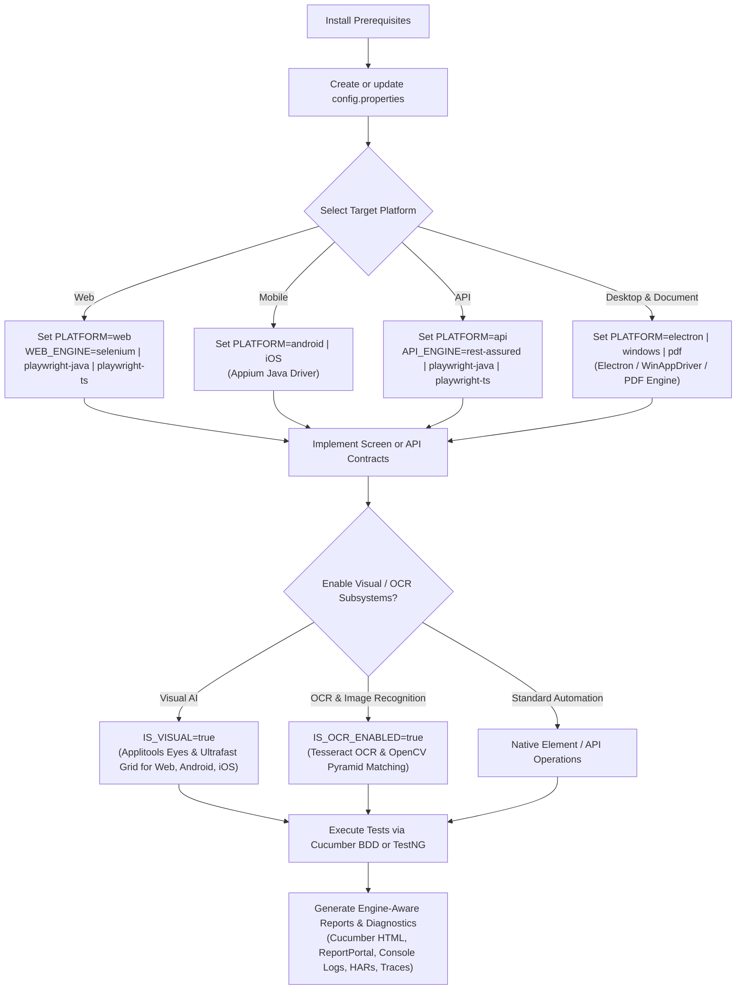
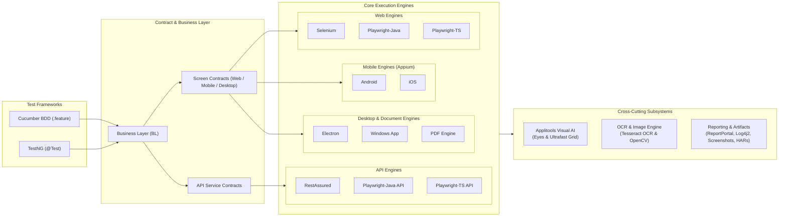

# 🧙‍♂️ teswiz

**Enterprise Multi-Platform Test Automation Framework for Web, Mobile, API, Desktop, Visual AI, & OCR**

[](https://jitpack.io/#anandbagmar/teswiz)
[](https://github.com/anandbagmar/teswiz/actions/workflows/Build_And_Run_Unit_Tests_CI.yml)
[](https://github.com/anandbagmar/teswiz/actions/workflows/codeql-analysis.yml)
[](https://github.com/anandbagmar/teswiz)

[📚 Documentation Hub](docs/index.md) • [🚀 Getting Started](#-getting-started) • [⚙️ Engine Selection](#%EF%B8%8F-engine-selection) • [🏗️ Architecture](#%EF%B8%8F-architecture) • [📊 Reporting](#-visual-testing--reporting)

---

## 🌟 Capability Matrix

| Platform / Subsystem | Supported Technology & Engines | Key Capabilities & Documentation |
| :--- | :--- | :--- |
| **🌐 Web Automation** | [`selenium`](docs/examples/web-selenium-example.md) • [`playwright-java`](docs/examples/web-playwright-java-example.md) • [`playwright-ts`](docs/examples/web-playwright-ts-example.md) | Multi-browser, stateful frames, async script execution, grid routing ([Web Engine Docs](docs/engines/web-engine-capabilities.md)) |
| **📱 Mobile Automation** | Appium 2 ([Android](docs/examples/android-example.md) & [iOS](docs/examples/ios-example.md)) | Native & web context, device cloud integration, gesture automation ([Mobile Docs](docs/engines/mobile-appium-setup.md)) |
| **🔌 API Testing** | [`rest-assured`](docs/examples/api-example.md) • [`playwright-java`](docs/engines/running-api-tests.md) • [`playwright-ts`](docs/engines/running-api-tests.md) | Data parity, 502/503/504 health filter, masked traffic logging (`api-traffic/`) ([API Docs](docs/engines/running-api-tests.md)) |
| **🖥️ Desktop & Document** | Electron • Windows AppDriver • Apache PDFBox | Desktop application UI automation & PDF content verification ([PDF Docs](docs/examples/pdf-example.md)) |
| **👁️ Visual AI** | Applitools Eyes & Ultrafast Grid (UFG) | Cross-browser visual check & AI baseline comparison for Web & Mobile ([Visual AI Docs](docs/subsystems/visual-ai-applitools.md)) |
| **🔍 Visual OCR & Image** | Tesseract 5 OCR & OpenCV 4.9 Pyramid Matcher | Embedded 100% offline text & image template locator matching (0 MB core) ([OCR Docs](docs/subsystems/ocr-and-image-recognition.md)) |
| **🧪 Test Frameworks** | Cucumber BDD (`.feature`) & TestNG (`@Test`) | Dual framework execution modes via `FRAMEWORK=cucumber \| testng` ([TestNG Guide](docs/architecture-and-internals/cucumber-to-testng-migration-guide.md)) |

---

> [!IMPORTANT]
> **Key Architectural & Upgrade Notes**
>
> 1. **Dual Framework Execution Modes (`FRAMEWORK`)**:
>    - `FRAMEWORK=cucumber` (default): Executes `.feature` files via Gherkin step definitions (`feature -> steps -> BL -> screen contract`).
>    - `FRAMEWORK=testng`: Executes plain TestNG `@Test` classes directly calling Business & Screen layers, skipping step definitions. ([Migration Guide](docs/architecture-and-internals/cucumber-to-testng-migration-guide.md))
> 2. **Explicit Web Engine Selection (`WEB_ENGINE`)**:
>    - Set `WEB_ENGINE=selenium` (default), `playwright-java`, or `playwright-ts` in your property config. ([Web Engine Capabilities](docs/engines/web-engine-capabilities.md))
> 3. **Playwright Screen Implementation Model**:
>    - `playwright-java` uses native Java screen classes (`*ScreenPlaywrightJava.java`).
>    - `playwright-ts` uses TypeScript screen modules resolved from `src/main/resources/playwright/screens` (common framework screens) and `src/test/resources/playwright/screens` (project screens). ([Playwright Migration Guide](docs/architecture-and-internals/playwright-migration-guide.md))
> 4. **Multi-Engine API Testing (`API_ENGINE`)**:
>    - Set `API_ENGINE=rest-assured` (default), `playwright-java`, or `playwright-ts`. Automatic health filtering (502/503/504) and traffic logging. ([Running API Tests](docs/engines/running-api-tests.md))
> 5. **On-Demand OCR & OpenCV Subsystem (`IS_OCR_ENABLED`)**:
>    - Tesseract 5 OCR and OpenCV multi-scale matching are `compileOnly` dependencies carrying **0 MB core weight**. Set `IS_OCR_ENABLED=true` to enable. ([OCR & Image Recognition](docs/subsystems/ocr-and-image-recognition.md))
> 6. **Cloud Provider Parity**:
>    - Playwright engines support local, Selenium Grid, BrowserStack, and LambdaTest execution. HeadSpin is intentionally unsupported and fails fast. ([Mobile & Cloud Setup](docs/engines/mobile-appium-setup.md))

---

## 🚀 Getting Started



### 📖 Recommended Reading Order

1. 🛠️ **[Prerequisites](docs/getting-started/prerequisites.md)**: Tooling, JDK, Node.js, and driver environment setup.
2. 🎬 **[Getting Started Guide](docs/getting-started/getting-started-guide.md)**: Introduction to teswiz concepts and setup.
3. 🎛️ **[Configure Test Execution](docs/getting-started/configuring-test-execution.md)**: Setting up properties, platforms, and frameworks.
4. ✍️ **[Write Your First Test](docs/getting-started/writing-first-test.md)**: Authoring Cucumber features, step definitions, BL, and screens.
5. 🧪 **[Sample Tests](docs/getting-started/sample-tests.md)**: Overview of bundled sample test suites.

---

## ⚙️ Engine Selection

### 🌐 Web Engine (`WEB_ENGINE`)

Set `WEB_ENGINE` in your suite configuration properties file:

```properties
WEB_ENGINE=selenium
```

| Value | Engine | Best Used For | Sample Code & Documentation |
| :--- | :--- | :--- | :--- |
| `selenium` | Selenium WebDriver | Standard W3C web automation | [Selenium Example](docs/examples/web-selenium-example.md) • [Capabilities](docs/engines/web-engine-capabilities.md) |
| `playwright-java` | Playwright Java | Fast, modern web execution using Java screen classes | [PW-Java Example](docs/examples/web-playwright-java-example.md) • [Migration Guide](docs/architecture-and-internals/playwright-migration-guide.md) |
| `playwright-ts` | Playwright TypeScript | High-performance web execution using TypeScript screen modules | [PW-TS Example](docs/examples/web-playwright-ts-example.md) • [Migration Guide](docs/architecture-and-internals/playwright-migration-guide.md) |

### 🔌 API Engine (`API_ENGINE`)

Set `API_ENGINE` in your suite configuration properties file or environment variables:

```properties
API_ENGINE=rest-assured
```

| Value | Engine | Best Used For | Sample Code & Documentation |
| :--- | :--- | :--- | :--- |
| `rest-assured` | RestAssured HTTP Client | Standard REST API automation (default) | [API Example](docs/examples/api-example.md) • [API Guide](docs/engines/running-api-tests.md) |
| `playwright-java` | Playwright Java `APIRequestContext` | High-throughput native Playwright API calls in Java | [API Guide](docs/engines/running-api-tests.md) • [Migration Plan](docs/todos/Playwright-API-Engine-Implementation-And-Migration-Plan.md) |
| `playwright-ts` | Playwright TypeScript Worker Protocol | Asynchronous API execution via TypeScript worker IPC | [API Guide](docs/engines/running-api-tests.md) • [Migration Plan](docs/todos/Playwright-API-Engine-Implementation-And-Migration-Plan.md) |

> 📖 **Read more**: [API Test Execution Guide](docs/engines/running-api-tests.md) • [API Example](docs/examples/api-example.md)

### 🧪 Test Framework (`FRAMEWORK`)

Set `FRAMEWORK` to choose your test authoring paradigm:

```properties
FRAMEWORK=cucumber
```

- `cucumber` (default): Runs `.feature` files via Cucumber step definitions (`feature -> steps -> BL -> screen`).
- `testng`: Runs plain TestNG `@Test` classes directly invoking Business Layer (`BL`) and Screen methods.

```bash
# Execute TestNG mode with tag group filtering
CONFIG=configs/cli_local_config.properties FRAMEWORK=testng TAG=@calculator ./gradlew run
```

> 📖 **Read more**: [Cucumber to TestNG Migration Guide](docs/architecture-and-internals/cucumber-to-testng-migration-guide.md) • [TestNG Execution Plan](docs/architecture-and-internals/testng-execution-mode-plan.md)

---

## 💻 Common Commands

```bash
# Clean build and compile
./gradlew clean build

# Verify screen contracts across all engines and platforms
./gradlew verifyScreenContracts

# Report missing screen contracts
./gradlew reportMissingScreenContracts
```

If you need a fresh dependency resolution:

```bash
./gradlew clean build -PforceUpdate=true
```

> [!TIP]
> Use JDK 17 or higher. Run `./gradlew verifyScreenContracts` explicitly whenever adding or migrating screen implementations.

---

## 👁️ Visual Testing & Reporting

**teswiz** integrates seamlessly with enterprise visual AI and real-time reporting infrastructure:

* **Applitools Eyes & Ultrafast Grid (UFG)**: Visual checking for Selenium Web, Playwright-Java Web, Playwright-TS Web, Android, and iOS ([Visual AI Guide](docs/subsystems/visual-ai-applitools.md)).
* **ReportPortal Integration**: Real-time publishing of engine, platform, provider, persona, and session metadata ([ReportPortal Setup](docs/subsystems/reportportal-integration.md)).
* **Unified Scenario Diagnostic Artifacts**: Console logs, rolling debug logs, screenshots, traces, HARs, and cloud provider session links ([Debugging Guide](docs/architecture-and-internals/debugging-tests.md)).

> 📖 **Read more**: [Running Visual Tests](docs/subsystems/visual-ai-applitools.md) • [ReportPortal Setup](docs/subsystems/reportportal-integration.md) • [Configuration Parameters](docs/configuration/configuration-parameters.md)

---

## 🔍 Diagnostics & Artifact Layout

Each test execution writes high-signal `INFO` logs to the console and detailed `DEBUG` diagnostics to rolling log files under `LOG_DIR/testLogs/teswizSampleTestLog.log`.

Command stdout and stderr are masked and saved per-command under `commandOutput/`. For framework method tracing, enable AspectJ logging explicitly:

```bash
./gradlew -DTESWIZ_METHOD_LOG_LEVEL=DEBUG run
```

> 📖 **Read more**: [Debugging Tests Guide](docs/architecture-and-internals/debugging-tests.md) • [AspectJ Auto-Logging](docs/subsystems/aspectj-logging.md)

---

## 🏗️ Architecture



> 📖 **Read detailed design notes**: [Runtime Architecture Notes](docs/architecture-and-internals/architecture-notes.md)

---

## 🤝 Contributing & Configuration Templates

`configs/teswiz/teswiz_config.properties.template` is the canonical contract for all configuration files. Every property in `configs/**/*.properties` must be synchronized with the template. ([Configuration Reference](docs/configuration/configuration-parameters.md))

Before opening a pull request:

```bash
# Validate property configuration templates
./gradlew validateConfigurationTemplates
```

---

[📚 Documentation Hub](docs/index.md) • [Report an Issue](https://github.com/anandbagmar/teswiz/issues)
