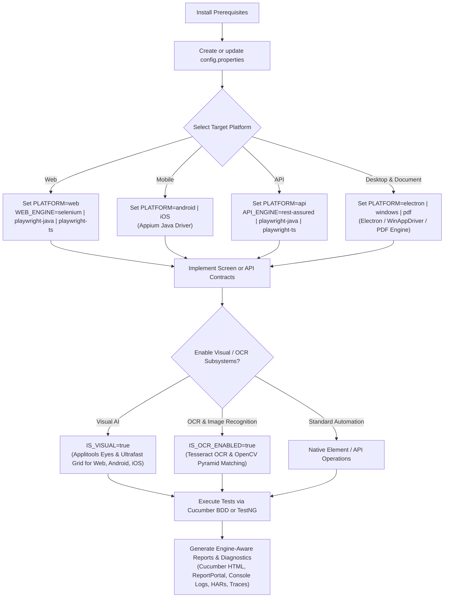
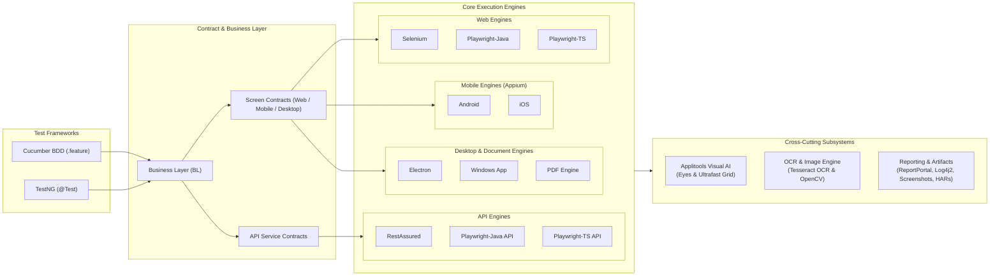

[](https://github.com/anandbagmar/teswiz)
[](https://github.com/anandbagmar/teswiz/stargazers)
[](https://github.com/anandbagmar/teswiz/pulls)
[](https://github.com/anandbagmar/teswiz/network)

## Status

[](https://jitpack.io/#anandbagmar/teswiz)
[](https://github.com/anandbagmar/teswiz/actions/workflows/Build_And_Run_Unit_Tests_CI.yml)
[](https://github.com/anandbagmar/teswiz/actions/workflows/codeql-analysis.yml)
[](https://jitpack.io/#anandbagmar/teswiz)

# teswiz

teswiz is a Java-first automation framework for:

- web: Selenium, Playwright-Java, Playwright-TS
- api: RestAssured, Playwright-Java, Playwright-TS
- mobile: Appium Java for Android and iOS
- desktop/web-adjacent: Electron, Windows apps, PDF validation
- visual testing: Applitools Eyes and Ultrafast Grid
- reporting: Cucumber HTML, ReportPortal, engine-aware artifacts

Two ways to author and run tests, selected via `FRAMEWORK`:

- `FRAMEWORK=cucumber` (default): `feature -> steps -> business layer -> screen contract`
- `FRAMEWORK=testng`: plain TestNG `@Test` classes call the business/screen layers directly, skipping the Gherkin/step-def layer

teswiz handles persona routing, session lifecycle, platform selection, cloud execution, and reporting underneath either flow.

## Key Architectural & Upgrade Notes

Read these key guidelines before configuring, upgrading, or authoring test suites in **teswiz**:

1. **Dual Framework Execution Modes (`FRAMEWORK`)**:
   - `FRAMEWORK=cucumber` (default): Executes `.feature` files via Gherkin step definitions.
   - `FRAMEWORK=testng`: Executes plain TestNG `@Test` classes calling Business & Screen layers directly, skipping step definitions.
2. **Explicit Web Engine Selection (`WEB_ENGINE`)**:
   - Supports `selenium` (default), `playwright-java`, and `playwright-ts`.
   - Existing Selenium suites continue to work uninterrupted. Playwright is opt-in per suite or scenario.
3. **Playwright Screen Implementation Model**:
   - `playwright-java` uses native Java screen classes (`*ScreenPlaywrightJava.java`).
   - `playwright-ts` uses TypeScript screen modules resolved from `src/main/resources/playwright/screens` (framework common screens) and `src/test/resources/playwright/screens` (project screens).
4. **Unified Multi-Engine API Testing (`API_ENGINE`)**:
   - Supports `rest-assured` (default), `playwright-java` (`APIRequestContext`), and `playwright-ts` (IPC Worker).
   - Provides automatic fail-fast environment health filters (502/503/504) and masked request/response logging under `target/reports/api-traffic/`.
5. **On-Demand OCR & OpenCV Subsystem (`IS_OCR_ENABLED`)**:
   - Tesseract 5 OCR and OpenCV 4.9 multi-scale matching are `compileOnly` dependencies carrying **0 MB core weight**.
   - Set `IS_OCR_ENABLED=true` in `config.properties` to enable text/template element locator capabilities across Web and Mobile.
6. **Visual AI & Ultrafast Grid (`IS_VISUAL`)**:
   - Set `IS_VISUAL=true` to run Applitools Eyes visual checks. Configure `useUFG: true` in `applitools_config.json` for multi-browser/device parallel rendering.
7. **Cloud Provider Parity & Fail-Fast Rules**:
   - `playwright-ts` and `playwright-java` support local, Selenium Grid, BrowserStack, and LambdaTest execution.
   - Playwright web on HeadSpin is intentionally unsupported and fails fast with a descriptive diagnostic message.

Detailed guidance:

- [Documentation Index](docs/index.md)
- [Breaking changes](docs/architecture-and-internals/breaking-changes.md)
- [Playwright migration guide](docs/architecture-and-internals/playwright-migration-guide.md)
- [Web engine capability & parity guide](docs/engines/web-engine-capabilities.md)
- [Architecture notes](docs/architecture-and-internals/architecture-notes.md)

## Get started



Recommended reading order:

1. [Prerequisites](docs/getting-started/prerequisites.md)
2. [Getting started](docs/getting-started/getting-started-guide.md)
3. [Configure test execution](docs/getting-started/configuring-test-execution.md)
4. [Write your first test](docs/getting-started/writing-first-test.md)
5. [Sample tests](docs/getting-started/sample-tests.md)

## Choose your web engine

Set this in your suite config:

```properties
WEB_ENGINE=selenium
```

Valid values:

- `selenium`
- `playwright-java`
- `playwright-ts`

Use:

- `selenium` when you want the current Selenium web path
- `playwright-java` when you want Playwright web with Java screen implementations
- `playwright-ts` when you want Playwright web with TypeScript screen modules

Examples:

- [Selenium web example](docs/examples/web-selenium-example.md)
- [Playwright-Java web example](docs/examples/web-playwright-java-example.md)
- [Playwright-TS web example](docs/examples/web-playwright-ts-example.md)
- [Android example](docs/examples/android-example.md)
- [iOS example](docs/examples/ios-example.md)
- [API example](docs/examples/api-example.md)

## Choose your API engine

Set this in your suite config or environment variable:

```properties
API_ENGINE=rest-assured
```

Valid values:

- `rest-assured` (default) - uses RestAssured for HTTP execution
- `playwright-java` - uses Playwright Java APIRequestContext for HTTP execution
- `playwright-ts` - uses Playwright TypeScript worker protocol for HTTP execution

Read more:

- [API test execution guide](docs/engines/running-api-tests.md)
- [API implementation example](docs/examples/api-example.md)

## Choose your test framework

Set this in your suite config or as an env var:

```properties
FRAMEWORK=cucumber
```

Valid values:

- `cucumber` (default) - runs `.feature` files via Cucumber step definitions, as today
- `testng` - runs plain TestNG `@Test` classes that call the business/screen layers directly, skipping the step-definition layer

`TAG` filtering works the same way in both modes; in TestNG mode tags map to TestNG groups.

```bash
CONFIG=configs/cli_local_config.properties FRAMEWORK=testng TAG=@calculator ./gradlew run
```

A project may contain both Cucumber feature files/step-defs and plain TestNG test classes, but a single execution runs only one mode.

Read more:

- [Configure test execution](docs/getting-started/configuring-test-execution.md)
- [Cucumber to TestNG migration guide](docs/architecture-and-internals/cucumber-to-testng-migration-guide.md)

## Common commands

```bash
./gradlew clean build
./gradlew verifyScreenContracts
./gradlew reportMissingScreenContracts
```

If you need a fresh dependency resolution:

```bash
./gradlew clean build -PforceUpdate=true
```

Notes:

- use JDK 17 or higher
- run `verifyScreenContracts` explicitly when adding or migrating screens
- use `-PincludeMissingScreenTargets=true` with `verifyScreenContracts` when you want stricter coverage reporting

## Visual testing and reporting

teswiz supports:

- Applitools Eyes for Selenium web, Playwright-Java web, Playwright-TS web, and mobile visual flows
- Applitools Ultrafast Grid for web visual runs
- ReportPortal publishing with engine, platform, provider, persona, and session metadata
- unified scenario artifacts such as screenshots, traces, console logs, HARs, and provider links

Read more:

- [Running visual tests](docs/subsystems/visual-ai-applitools.md)
- [ReportPortal setup](docs/subsystems/reportportal-integration.md)
- [Configuration parameters](docs/configuration/configuration-parameters.md)

## Logging and diagnostics

Each run writes a primary log under `LOG_DIR/testLogs/teswizSampleTestLog.log`. Console output is kept at high-signal `INFO` level, while the primary file retains `DEBUG` diagnostics. The file rolls daily or when it reaches 50 MB, retaining up to 14 archived files.

Scenario logs include the scenario number, example row, and worker thread so parallel executions can be followed reliably. Command stdout and stderr are masked and written under each scenario's `commandOutput/` directory; the main log records the command result and artifact location.

For framework method tracing, enable it explicitly:

```bash
./gradlew -DTESWIZ_METHOD_LOG_LEVEL=DEBUG run
```

See [Debugging tests](docs/architecture-and-internals/debugging-tests.md) and [configuration parameters](docs/configuration/configuration-parameters.md) for the logging controls and artifact layout.

## Architecture

teswiz uses a unified architecture connecting test frameworks, contract layers, engine adapters, and visual/OCR subsystems:



The detailed design notes are documented separately in:

- [Architecture notes](docs/architecture-and-internals/architecture-notes.md)

That doc covers:

- Java orchestration layer
- Selenium, Playwright-Java, and Playwright-TS web engines
- Appium mobile execution (Android & iOS)
- RestAssured, Playwright-Java, and Playwright-TS API engines
- Electron, Windows, and PDF validation engines
- Applitools Visual AI integration (Web & Mobile)
- Tesseract OCR & OpenCV Multi-Scale Image Recognition
- screen resolution and contract verification
- cloud/provider adapters
- reporting and visual integration

## CI notes

For GitHub Actions in this repo:

- use `actions/setup-node` before Node-based installs
- use `npm ci` in CI workflows
- commit `package-lock.json` whenever `package.json` dependencies or overrides change
- install Playwright browsers only in workflows that actually execute Playwright
- keep only the latest artifact set per workflow for user-created branches
- do not retain artifacts for dependency-management branches such as `dependabot/*` or `renovate/*`

## Contributing

If you are adding or migrating screen implementations:

1. keep the screen contract stable
2. add the engine/platform-specific implementation
3. run `./gradlew verifyScreenContracts`
4. add or update the relevant sample/docs if user-facing behavior changed

### Configuration files

`configs/teswiz/teswiz_config.properties.template` is the canonical contract for execution
configuration files. Every `configs/**/*.properties` file must contain every property from the
template, either active or commented, while preserving values specific to that example.

When adding or changing a configuration file:

1. update the canonical template first when introducing a supported property
2. keep the property in the same order as the template
3. leave unused properties commented with their default or supported values
4. run `./gradlew validateConfigurationTemplates`

The same validation runs automatically as part of `./gradlew test`, `./gradlew check`,
`./gradlew build`, `./gradlew shadowJar`, and CI builds.
