[🏠 Main README](../README.md)

---

Welcome to the **teswiz** framework documentation. Use the index below to find guides, engine capability references, subsystems, configuration parameters, and architectural notes.

---

## 🗺️ Documentation Taxonomy

```mermaid
flowchart TD
    INDEX --> ENG["⚙️ Core Engines"]
    INDEX --> SUB["🧩 Subsystems"]
    INDEX --> CFG["🎛️ Configuration"]
    INDEX --> EX["💡 Code Examples"]
    INDEX --> ARCH["🏗️ Architecture & Internals"]

    GS --> GS1["Prerequisites"]
    GS --> GS2["Getting Started Guide"]
    GS --> GS3["Writing Your First Test"]
    GS --> GS4["Configuring Test Execution"]
    GS --> GS5["Sample Tests Overview"]

    ENG --> ENG1["Web Engines (Selenium / PW-Java / PW-TS)"]
    ENG --> ENG2["Mobile Setup (Appium Android & iOS)"]
    ENG --> ENG3["API Engines (RestAssured / PW-Java / PW-TS)"]

    SUB --> SUB1["Applitools Visual AI"]
    SUB --> SUB2["Tesseract OCR & OpenCV"]
    SUB --> SUB3["ReportPortal Integration"]
    SUB --> SUB4["AspectJ Logging"]
    SUB --> SUB5["BrowserStack Local"]

    CFG --> CFG1["Configuration Parameters"]
    CFG --> CFG2["Docker Setup"]
    CFG --> CFG3["Hard Gate Execution"]

    EX --> EX1["Web Examples (Selenium, PW-Java, PW-TS)"]
    EX --> EX2["Mobile Examples (Android, iOS)"]
    EX --> EX3["API & Document Examples (API, PDF)"]

    ARCH --> ARCH1["Architecture Notes"]
    ARCH --> ARCH2["Feature Coverage"]
    ARCH --> ARCH3["Playwright & TestNG Migration Guides"]
    ARCH --> ARCH4["Debugging & FAQs"]
```

---

## 🚀 Getting Started

- [Prerequisites](getting-started/prerequisites.md): Tooling, JDK, Node.js, and driver environment setup.
- [Getting Started Guide](getting-started/getting-started-guide.md): Step-by-step introduction to teswiz.
- [Writing Your First Test](getting-started/writing-first-test.md): Authoring Cucumber BDD features, step definitions, Business Layer (BL), and screen contracts.
- [Configuring Test Execution](getting-started/configuring-test-execution.md): Running suites via Cucumber or TestNG modes (`FRAMEWORK=cucumber | testng`).
- [Sample Tests Overview](getting-started/sample-tests.md): Guide to bundled sample test suites.

---

## ⚙️ Core Engines

- [Web Engine Capabilities & Parity](engines/web-engine-capabilities.md): Cross-engine support matrix across `selenium`, `playwright-java`, and `playwright-ts`.
- [Mobile Execution Setup](engines/mobile-appium-setup.md): Appium 2 driver setup for Android and iOS execution.
- [API Test Execution](engines/running-api-tests.md): Unified API execution via `rest-assured`, `playwright-java`, and `playwright-ts`.

---

## 🧩 Cross-Cutting Subsystems

- [Applitools Visual AI Integration](subsystems/visual-ai-applitools.md): Applitools Eyes and Ultrafast Grid (UFG) configuration for Web and Mobile visual testing.
- [OCR & Multi-Scale Image Recognition](subsystems/ocr-and-image-recognition.md): Embedded offline Tesseract 5 OCR and OpenCV 4.9 template matching engine.
- [ReportPortal Integration](subsystems/reportportal-integration.md): Publishing real-time test execution metadata and logs to ReportPortal.
- [AspectJ Method Logging](subsystems/aspectj-logging.md): Tracing framework and test method execution via AspectJ.
- [BrowserStack Local Testing](subsystems/browserstack-local.md): Configuring secure tunnel connections for BrowserStack.

---

## 🎛️ Configuration & Infrastructure

- [Configuration Parameters Reference](configuration/configuration-parameters.md): Canonical reference for `config.properties` settings.
- [Docker Execution Setup](configuration/docker-setup.md): Running teswiz tests inside Docker containers.
- [Hard Gate Execution Mode](configuration/hard-gate.md): Setting hard quality gates for known-failing test suites (`IS_FAILING_TEST_SUITE`).

---

## 💡 Code Examples

- **Web Automation**:
  - [Web Selenium Example](examples/web-selenium-example.md)
  - [Web Playwright-Java Example](examples/web-playwright-java-example.md)
  - [Web Playwright-TS Example](examples/web-playwright-ts-example.md)
- **Mobile Automation**:
  - [Android Example](examples/android-example.md)
  - [iOS Example](examples/ios-example.md)
- **API & Document Validation**:
  - [API Execution Example](examples/api-example.md)
  - [PDF Document Validation Example](examples/pdf-example.md)

---

## 🏗️ Architecture & Internals

- [Runtime Architecture Notes](architecture-and-internals/architecture-notes.md): Comprehensive design note on engine adapters, persona routing, and screen resolution.
- [Feature Coverage Matrix](architecture-and-internals/feature-coverage.md): Feature matrix and platform capability breakdown.
- [Playwright Migration Guide](architecture-and-internals/playwright-migration-guide.md): Porting Selenium suites to Playwright-Java or Playwright-TS.
- [Cucumber to TestNG Migration Guide](architecture-and-internals/cucumber-to-testng-migration-guide.md): Porting Cucumber features to plain TestNG `@Test` classes.
- [Breaking Changes Log](architecture-and-internals/breaking-changes.md): Version history and upgrade notes.
- [Debugging Tests](architecture-and-internals/debugging-tests.md): Log analysis, artifact inspection, and troubleshooting guide.
- [Frequently Asked Questions (FAQs)](architecture-and-internals/faqs.md): Common questions and answers.
