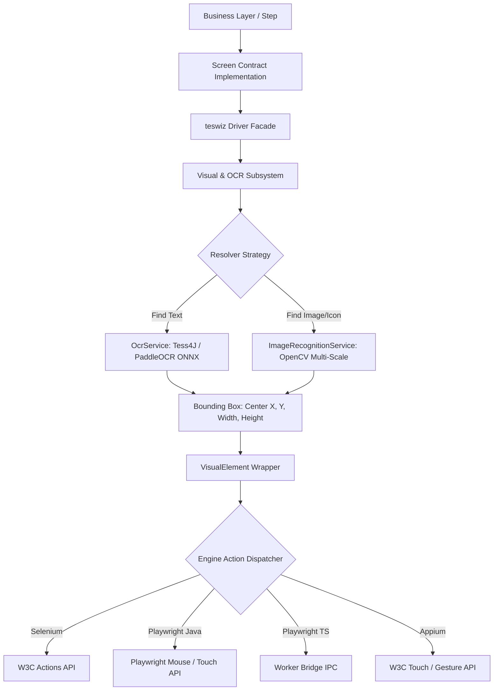

# Detailed Architectural & Usage Plan: OCR and Image Recognition in teswiz
[📚 Documentation Index](../index.md) | [🏠 Main README](../../README.md)

---


## Table of Contents

- [1. Executive Summary & Core Objective](#1-executive-summary--core-objective)
  - [Core Goals:](#core-goals)
- [2. Capability Bounds: Supported vs. Unsupported](#2-capability-bounds-supported-vs-unsupported)
  - [✅ Supported Capabilities](#-supported-capabilities)
  - [❌ Unsupported / Out-of-Scope Limitations](#-unsupported--out-of-scope-limitations)
- [3. Architecture & Engine Interaction Pipeline](#3-architecture--engine-interaction-pipeline)
- [4. Class Placement & Method Signatures](#4-class-placement--method-signatures)
  - [A. Architectural Placement](#a-architectural-placement)
  - [B. Method Signature Design: Varargs + Overloads](#b-method-signature-design-varargs--overloads)
  - [C. Screen Implementation Usage (`*Screen*.java`)](#c-screen-implementation-usage-screenjava)
- [5. Multi-Resolution & Template Storage Strategy](#5-multi-resolution--template-storage-strategy)
  - [Q: Does the provided template image need to be of the exact same pixel size as displayed in the application?](#q-does-the-provided-template-image-need-to-be-of-the-exact-same-pixel-size-as-displayed-in-the-application)
  - [Template Storage Organization:](#template-storage-organization)
- [6. Embedded Local Engine Subsystem Model](#6-embedded-local-engine-subsystem-model)
- [7. Implementation Roadmap & Status](#7-implementation-roadmap--status)
- [8. OCR Library Options & Evaluation Matrix](#8-ocr-library-options--evaluation-matrix)
- [9. OS, Environment & Execution Matrix Analysis](#9-os-environment--execution-matrix-analysis)
  - [A. Environment Support Breakdown](#a-environment-support-breakdown)
  - [B. Execution Architecture Key Insights](#b-execution-architecture-key-insights)
- [10. Licensing, Open-Source & Cost Breakdown](#10-licensing-open-source--cost-breakdown)
- [11. Deep Technical Comparison: Tess4J vs. PaddleOCR vs. EasyOCR](#11-deep-technical-comparison-tess4j-vs-paddleocr-vs-easyocr)
  - [A. Feature & Architecture Comparison Matrix](#a-feature--architecture-comparison-matrix)
  - [B. Detailed Breakdown of Each Engine](#b-detailed-breakdown-of-each-engine)
- [12. Simplified Configuration & Unified Multimodal Strategy](#12-simplified-configuration--unified-multimodal-strategy)
  - [A. Single Master Enablement Property Syntax](#a-single-master-enablement-property-syntax)
  - [B. On-Demand Dynamic Dependency Resolution via Gradle (`downloadDependency`)](#b-on-demand-dynamic-dependency-resolution-via-gradle-downloaddependency)
- [13. Decoupled Compilation Architecture: Preventing Java Compile Errors](#13-decoupled-compilation-architecture-preventing-java-compile-errors)
  - [Q: If visual dependencies are downloaded on-demand, will methods like `driver.findByImage(...)` cause Java compilation errors?](#q-if-visual-dependencies-are-downloaded-on-demand-will-methods-like-driverfindbyimage-cause-java-compilation-errors)
- [14. Summary of Capabilities & Final Architecture Matrix](#14-summary-of-capabilities--final-architecture-matrix)

---


## 1. Executive Summary & Core Objective

This document defines the production specification for **OCR (Optical Character Recognition)** and **Image Recognition** in `teswiz`.

### Core Goals:
- **Zero Impact on Scenarios/Steps/BL**: Test scenarios, step definitions, and business layers remain 100% unchanged. Screen classes call methods on `Driver` to locate and interact with visual elements.
- **Full Engine Parity across all 4 Runtimes**:
  - `WEB_ENGINE=selenium`
  - `WEB_ENGINE=playwright-java`
  - `WEB_ENGINE=playwright-ts`
  - `PLATFORM=android` / `PLATFORM=iOS` (Appium)
- **Target Surfaces**:
  - **Web Browsers & Mobile-Web Browsers**: HTML5 `<canvas>`, `<svg>` (e.g. Google Maps, charts, complex diagrams).
  - **Native Apps (Android & iOS)**: Custom canvas views, static 2D game controls (e.g. "SPIN" button text or icon), non-DOM UI elements.
- **Fast, Deterministic, & Reliable**: Sub-50ms visual element location using cached multi-scale template matching and local OCR.

---

## 2. Capability Bounds: Supported vs. Unsupported

### ✅ Supported Capabilities

| Capability | Web Browsers | Mobile Web | Native Android | Native iOS |
| :--- | :---: | :---: | :---: | :---: |
| **Locate by Text (OCR)** | ✅ | ✅ | ✅ | ✅ |
| **Locate by Image Template (Icons)** | ✅ | ✅ | ✅ | ✅ |
| **Canvas & SVG Interaction** | ✅ | ✅ | ✅ | ✅ |
| **Game Controls (Text / Icon)** | ✅ | ✅ | ✅ | ✅ |
| **Web Actions (Click, Double-Click, Hover, Type)** | ✅ | ✅ | N/A | N/A |
| **Mobile Actions (Tap, Double-Tap, Drag, Pinch, Zoom)** | N/A | ✅ | ✅ | ✅ |

### ❌ Unsupported / Out-of-Scope Limitations

1. **3D WebGL & Fast-Moving Animated Sprites**:
   - Objects moving continuously at 60fps without frame pauses (e.g. spinning slot machine reels in motion). Visual matching requires the target element to be in a stable frame state.
2. **CAPTCHAs & Distorted Security Text**:
   - Anti-scraping text, distorted CAPTCHAs, or warped security challenges designed specifically to defeat OCR engines.
3. **Low-Contrast & Sub-Pixel Text**:
   - Text with contrast ratios below WCAG standards (< 2:1) or text under 8px height.
4. **Live Streaming Video Frames**:
   - Unpaused live video streams (HLS/WebRTC).

---

## 3. Architecture & Engine Interaction Pipeline



---

## 4. Class Placement & Method Signatures

### A. Architectural Placement
- **Public Facade**: All visual locator methods (`findByText`, `findByImage`, `findByTextOrImage`, `findByImageOrText`) are added to **`Driver.java`**.
  - `Driver.java` is the primary interface used by Screen classes (`*Screen*.java`).
- **Internal Delegation**:
  - `Driver` delegates visual locate calls to `Visual.java` / `VisualDriver`.
  - `VisualDriver` queries `OcrService` (Tess4J / PaddleOCR ONNX) or `ImageRecognitionService` (OpenCV) depending on the method invoked.
  - The resolved element coordinates `(x, y, width, height)` are returned as a `VisualElement` wrapper.

```
Driver.java (Facade)
  └── Visual.java (Visual Subsystem Manager)
        ├── OcrService (Tess4J / PaddleOCR ONNX)
        └── ImageRecognitionService (OpenCV Pyramid Engine)
              └── returns VisualElement (Platform-agnostic W3C/Playwright Action Dispatcher)
```

### B. Method Signature Design: Varargs + Overloads
To provide maximum cleanliness and flexibility for screen writers, `Driver.java` provides **overloaded methods with varargs support**. Callers never need to explicitly instantiate `List.of(...)` unless they already possess a `List<String>`.

```java
// --- SINGLE IMAGE CONVENIENCE / VARARGS ---
public VisualElement findByImage(String... imageTemplatePaths);
public VisualElement findByImage(double confidenceThreshold, String... imageTemplatePaths);

// --- LIST OF IMAGES OVERLOADS ---
public VisualElement findByImage(List<String> imageTemplatePaths);
public VisualElement findByImage(List<String> imageTemplatePaths, double confidenceThreshold);

// --- HYBRID TEXT + IMAGE SEARCH (Text First) ---
public VisualElement findByTextOrImage(String text, String... imageTemplatePaths);
public VisualElement findByTextOrImage(String text, List<String> imageTemplatePaths);
public VisualElement findByTextOrImage(String text, List<String> imageTemplatePaths, double confidenceThreshold);

// --- HYBRID IMAGE + TEXT SEARCH (Image First) ---
public VisualElement findByImageOrText(List<String> imageTemplatePaths, String text);
public VisualElement findByImageOrText(String[] imageTemplatePaths, String text);
```

### C. Screen Implementation Usage (`*Screen*.java`)

```java
// 1. Locate element by text using OCR
VisualElement spinTextButton = driver.findByText("SPIN");

// 2. Locate element by a SINGLE visual template icon
VisualElement spinIconButton = driver.findByImage("visualTemplates/spin_icon.png");

// 3. Locate element using VARARGS (multiple candidate templates)
VisualElement spinButton = driver.findByImage(
    "visualTemplates/spin_gold.png",
    "visualTemplates/spin_neon.png",
    "visualTemplates/spin_circular.png"
);

// 4. Locate element using a List<String>
List<String> candidateTemplates = List.of("templates/v1.png", "templates/v2.png");
VisualElement spinButtonFromList = driver.findByImage(candidateTemplates);

// 5. Search by text FIRST (OCR); fall back to candidate image templates if text is not found
VisualElement spinAny = driver.findByTextOrImage("SPIN", "visualTemplates/spin_icon_v1.png", "visualTemplates/spin_icon_v2.png");

// 6. Search by image templates FIRST; fall back to OCR text search if no template matches
VisualElement spinAnyImageFirst = driver.findByImageOrText(candidateTemplates, "SPIN");
```

---

## 5. Multi-Resolution & Template Storage Strategy

### Q: Does the provided template image need to be of the exact same pixel size as displayed in the application?

> **NO.** The template image does **NOT** need to match the exact pixel dimensions of the displayed UI element in the target application.

#### Technical Sizing & Scaling Architecture:
1. **Multi-Scale Gaussian Image Pyramid Matching (OpenCV)**:
   - `ImageRecognitionService` automatically constructs a multi-scale pyramid of the template image across scaling factors (e.g., `0.5x`, `0.75x`, `1.0x`, `1.25x`, `1.5x`, `2.0x`).
   - The scaling range is dynamically anchored to the target platform's `devicePixelRatio` / screen density (e.g., `@1x`, `@2x`, `@3x` Retina or Android `xdpi`/`xxdpi`).
2. **Aspect Ratio Preservation**:
   - Matching is scale-invariant as long as the relative aspect ratio of the template icon/graphic remains constant.
3. **Template Best Practices**:
   - Save candidate templates at the highest native resolution available (e.g. 1080p / `@3x`). Multi-scale matching automatically downsamples to match smaller mobile screens or scaled browser viewports.

### Template Storage Organization:
```
src/test/resources/visualTemplates/
├── default/
│   ├── spin_gold.png
│   ├── spin_neon.png
│   └── map_pin.png
├── 1920x1080/
└── xxxdpi/
```

---

## 6. Embedded Local Engine Subsystem Model

> [!IMPORTANT]
> **Scope & Provider Architecture**:
> - **Applitools Exclusion**: Applitools is excluded from the OCR & Image Recognition locator subsystem because Applitools visual text extraction is supported only on `playwright-ts`. `teswiz` requires 100% uniform OCR and image recognition parity across **all 4 execution engines** (`WEB_ENGINE=selenium`, `WEB_ENGINE=playwright-java`, `WEB_ENGINE=playwright-ts`, and `PLATFORM=android`/`PLATFORM=iOS` via Appium).
> - **Applitools Role**: Applitools Eyes remains dedicated exclusively to visual regression testing (`visually.checkWindow(...)`).
> - **OCR Subsystem**: The OCR & Image Recognition subsystem is **100% self-contained, embedded, offline, free, and open-source (Apache 2.0)** using Tess4J (Tesseract 5), PaddleOCR (PP-OCR v4 via ONNX Runtime), and OpenCV Multi-Scale Image Pyramid matching.

---

## 7. Implementation Roadmap & Status

| Phase | Milestone | Deliverables | Status |
| :--- | :--- | :--- | :---: |
| **Phase 1** | Configuration Contracts | Added `IS_OCR_ENABLED` & `VISUAL_CONFIDENCE_THRESHOLD` to canonical `teswiz_config.properties.template` and all 50+ example configs; verified template consistency (`./gradlew validateConfigurationTemplates`). | ✅ **COMPLETED** |
| **Phase 2** | Facade API & Exceptions | Implemented `Driver.findByText()`, `findByImage()`, `findByTextOrImage()`, `findByImageOrText()`, `VisualElement` interaction wrapper, `VisualSubsystemDisabledException`, and `NoSuchVisualElementException`. | ✅ **COMPLETED** |
| **Phase 3** | Core Engine Services | Implement `OcrService.java` (Tess4J 5 / PaddleOCR ONNX text region detector) and `ImageRecognitionService.java` (OpenCV Multi-Scale Image Pyramid template matcher). | 🚀 **IN PROGRESS** |
| **Phase 4** | Action Dispatcher Wiring | Wire real element bounding boxes `(x, y, width, height)` to Selenium W3C Actions, Playwright Mouse API, and Appium Touch Gesture API. | ⏳ **PLANNED** |
| **Phase 5** | Verification & README | Add BDD test scenarios for Google Maps canvas & game controls; publish `docs/features/OCR-and-Image-Recognition-README.md`. | ⏳ **PLANNED** |

---

## 8. OCR Library Options & Evaluation Matrix

| OCR Option | Type | Language / Binding | Accuracy on Standard Text | Accuracy on Game Graphics / Canvas | Latency / Overhead | License & Offline | Recommendation for `teswiz` |
| :--- | :--- | :--- | :---: | :---: | :---: | :---: | :--- |
| **Tess4J (Tesseract 5)** | Embedded C++ Library | Java JNA (`tess4j`) / JS (`tesseract.js`) | ⭐⭐⭐⭐ (High) | ⭐⭐⭐ (Medium - requires OpenCV preprocessing) | Fast (~20-50ms local) | Apache 2.0 (100% Offline) | **Primary Default for `IS_VISUAL=false`** |
| **PaddleOCR / PP-OCR** | Deep Learning (ONNX) | Java (`onnxruntime` / DJL) | ⭐⭐⭐⭐⭐ (Very High) | ⭐⭐⭐⭐⭐ (High on complex styled text) | Medium (~50-100ms ONNX model execution) | Apache 2.0 (100% Offline) | **Pluggable Alternative Engine** for complex Canvas/Game text |
| **EasyOCR** | Deep Learning (PyTorch/ONNX) | Java ONNX Runtime | ⭐⭐⭐⭐⭐ (Very High) | ⭐⭐⭐⭐⭐ (High) | Slower (~100-250ms per frame) | Apache 2.0 (100% Offline) | High memory footprint (~100MB+ models) |
| **Apple Vision Framework** | OS Native | Mac/iOS (`VNRecognizeTextRequest`) | ⭐⭐⭐⭐⭐ (Native HW accelerated) | ⭐⭐⭐⭐ (High) | Ultra Fast (~10-20ms Apple Neural Engine) | Proprietary (macOS/iOS only) | **Native Accelerator** for macOS/iOS runners |
| **Google ML Kit Text Recognition** | Device Native | Android (`com.google.mlkit:text-recognition`) | ⭐⭐⭐⭐⭐ (Native HW accelerated) | ⭐⭐⭐⭐ (High) | Ultra Fast (~10-20ms Android NPU) | Apache 2.0 (Android only) | **Native Accelerator** for Android Appium runs |
| **Applitools Eyes OCR** | Cloud SaaS | REST API / Applitools Java SDK | ⭐⭐⭐⭐⭐ (State of the art) | ⭐⭐⭐⭐⭐ (State of the art) | Network dependent (~150-300ms) | Commercial SaaS (Requires API Key) | **Primary Default for `IS_VISUAL=true`** |
| **Google Cloud Vision / AWS Rekognition** | Cloud SaaS | REST API / SDK | ⭐⭐⭐⭐⭐ (State of the art) | ⭐⭐⭐⭐⭐ (State of the art) | Network dependent (~200-400ms) | Commercial Pay-per-request | Alternative Cloud Provider |

---

## 9. OS, Environment & Execution Matrix Analysis

### A. Environment Support Breakdown

| OCR Option | Windows (Non-Admin Mode) | Linux (CI & Docker Nodes) | macOS (Intel & Apple Silicon) | Headed Mode | Headless Mode (CI / XVFB) | Requires Root/Admin Install? |
| :--- | :---: | :---: | :---: | :---: | :---: | :---: |
| **Tess4J (Tesseract 5)** | ✅ YES (auto-extracts `.dll` to user `%TEMP%`) | ✅ YES (auto-extracts `.so` to `/tmp`) | ✅ YES (auto-extracts `.dylib`) | ✅ YES | ✅ YES | ❌ NO (Bundled in JAR) |
| **PaddleOCR via ONNX Runtime** | ✅ YES (auto-extracts `onnxruntime.dll`) | ✅ YES (CPU `libonnxruntime.so`) | ✅ YES (Universal binary) | ✅ YES | ✅ YES | ❌ NO (Bundled in JAR) |
| **Applitools Eyes OCR (`IS_VISUAL=true`)** | ✅ YES (Pure HTTPS API) | ✅ YES (Pure HTTPS API) | ✅ YES (Pure HTTPS API) | ✅ YES | ✅ YES | ❌ NO (API Key based) |
| **Apple Vision Framework** | ❌ NO (macOS only) | ❌ NO (macOS only) | ✅ YES | ✅ YES | ✅ YES | ❌ NO |
| **Google ML Kit** | ❌ NO (Android device/emulator only) | ❌ NO | ❌ NO | ✅ YES | ✅ YES | ❌ NO |

### B. Execution Architecture Key Insights

1. **Windows Non-Admin Mode Guarantee**:
   - Both **Tess4J** and **ONNX Runtime (PaddleOCR)** package all required native C++ binaries (`.dll` for Windows, `.so` for Linux, `.dylib` for macOS) directly inside their respective Maven JAR files.
   - Upon initialization, the Java ClassLoader extracts the required native library file to the current user's temporary directory (`System.getProperty("java.io.tmpdir")`), which requires **zero admin privileges, zero installer execution, and zero system registry modifications**.

2. **Headed vs. Headless Mode Parity**:
   - In `teswiz`, OCR engines process **in-memory screenshot streams** (`BufferedImage` / `byte[]`) captured directly from `WebDriver`, `Playwright Page`, or `AppiumDriver`.
   - Because screenshot stream capture operates on the browser's/app's rendered frame buffer in memory, OCR detection accuracy, performance, and behavior are **100% identical** in both Headed mode and Headless mode (including Linux CI Docker containers running headless or under XVFB).

3. **Linux CI Container Portability**:
   - No pre-installed OS-level packages (`apt-get install tesseract-ocr`) are required on Linux CI runner images if we use bundled `tess4j` / `onnxruntime` Maven JARs. Everything runs out of the box on standard Ubuntu/Debian/Alpine CI runners.

---

## 10. Licensing, Open-Source & Cost Breakdown

| OCR Option | Open Source Status | License Type | Commercial Use Cost | Internet Dependency |
| :--- | :---: | :--- | :---: | :---: |
| **Tess4J (Tesseract 5)** | ✅ **100% Open Source** | Apache License 2.0 | **$0 (Free)** | ❌ 100% Offline |
| **PaddleOCR (PP-OCR)** | ✅ **100% Open Source** | Apache License 2.0 | **$0 (Free)** | ❌ 100% Offline |
| **EasyOCR** | ✅ **100% Open Source** | Apache License 2.0 | **$0 (Free)** | ❌ 100% Offline |
| **Apple Vision Framework** | ❌ OS Built-in | Apple OS License | **$0 (Included with macOS/iOS)** | ❌ 100% Offline |
| **Google ML Kit Text** | ✅ Open SDK | Apache 2.0 / Google Terms | **$0 (Included with Android)** | ❌ 100% Offline |
| **Applitools Eyes OCR** | ❌ Commercial SaaS | Proprietary SaaS | Commercial Subscription | ✅ Requires Internet |
| **Google Cloud Vision** | ❌ Cloud Service | Proprietary API | Pay-per-request (~$1.50 / 1k calls) | ✅ Requires Internet |

---

## 11. Deep Technical Comparison: Tess4J vs. PaddleOCR vs. EasyOCR

### A. Feature & Architecture Comparison Matrix

| Evaluation Dimension | Tess4J (Tesseract 5) | PaddleOCR (PP-OCR v4 via ONNX) | EasyOCR (CRAFT + ResNet via ONNX) |
| :--- | :--- | :--- | :--- |
| **Underlying Architecture** | Traditional OCR + LSTM Neural Net (C++ Leptonica) | Deep Learning 2-Stage Pipeline (DBNet Detector + SVTR Recognizer) | Deep Learning 2-Stage Pipeline (CRAFT Detector + ResNet Recognizer) |
| **Primary Strength** | Ultra-fast execution on standard UI text; extremely lightweight footprint. | State-of-the-art accuracy on styled fonts, low contrast, canvas, & game graphics. | Excellent accuracy on curved & rotated artistic text. |
| **Average Latency / Frame** | **20 – 50 ms** ⚡ (Fastest) | **40 – 90 ms** 🚀 (Fast ONNX CPU) | **120 – 300 ms** 🐢 (Slower on CPU) |
| **Accuracy: Standard UI Text** | ⭐⭐⭐⭐ (90–95%) | ⭐⭐⭐⭐⭐ (98–99%) | ⭐⭐⭐⭐⭐ (98–99%) |
| **Accuracy: Canvas / SVG / Games** | ⭐⭐⭐ (60–75%, requires OpenCV binarization) | ⭐⭐⭐⭐⭐ (95–98% out of the box) | ⭐⭐⭐⭐⭐ (95–98% out of the box) |
| **Accuracy: Low-Contrast / Transparent** | ⭐⭐ (Requires adaptive thresholding) | ⭐⭐⭐⭐⭐ (DBNet handles low contrast) | ⭐⭐⭐⭐ (High accuracy) |
| **Total Artifact Size** | **~25 MB** (JAR + `eng.traineddata`) | **~40 MB** (ONNX JAR + `.onnx` models) | **~120 MB+** (PyTorch/ONNX models) |
| **JVM Integration in `teswiz`** | Native JNA Java library (`tess4j`) | Java ONNX Runtime (`onnxruntime`) | Java ONNX Runtime (`onnxruntime`) |
| **Dependencies Needed** | `net.sourceforge.tess4j:tess4j` | `com.microsoft.onnxruntime:onnxruntime` | `com.microsoft.onnxruntime:onnxruntime` |
| **License & Commercial Cost** | Apache 2.0 ($0 Free) | Apache 2.0 ($0 Free) | Apache 2.0 ($0 Free) |

---

### B. Detailed Breakdown of Each Engine

#### 1. Tess4J (Tesseract 5)
- **How it works**: Uses a hybrid traditional layout analysis + LSTM (Long Short-Term Memory) recurrent neural network.
- **When to use**: Standard web and mobile application UI testing where text is rendered using standard system fonts (Arial, Roboto, San Francisco) with clear background contrast.
- **Pros**:
  - Lowest execution latency (~20–50ms).
  - Tiny memory and disk footprint (~25MB total).
  - Direct JNA Java binding (`net.sourceforge.tess4j:tess4j`) requires zero neural network tensor manipulation code.
- **Cons**:
  - Requires OpenCV image preprocessing (grayscale, adaptive thresholding, noise removal) when dealing with complex game backgrounds or semi-transparent overlay text.

#### 2. PaddleOCR (PP-OCR v4)
- **How it works**: Uses a modern two-stage deep learning model. Stage 1 (DBNet) detects text region bounding boxes regardless of angle or background noise. Stage 2 (SVTR) recognizes characters within detected bounding boxes.
- **When to use**: High-precision canvas, SVG, chart, and 2D game UI testing (e.g. Google Maps markers, slot machine buttons, HUD overlays).
- **Pros**:
  - Highest out-of-the-box accuracy on complex, non-standard, or styled graphics without needing image thresholding tweaks.
  - Highly optimized ONNX C++ runtime executes fast (~40–90ms) on CPU test runners without GPU requirements.
  - Moderate footprint (~40MB total).
- **Cons**:
  - Requires ONNX Runtime tensor input/output buffer mapping in Java.

#### 3. EasyOCR
- **How it works**: Uses CRAFT (Character Region Awareness for Text Detection) combined with ResNet and LSTM.
- **When to use**: Scene text and heavily artistic fonts.
- **Pros**: Great text detection accuracy.
- **Cons**: Significantly higher latency on CPU (~120–300ms) and large model size (~120MB+), making it less ideal for high-throughput automated test suites compared to PaddleOCR and Tess4J.

---

---

## 12. Simplified Configuration & Unified Multimodal Strategy

### A. Single Master Enablement Property Syntax
To follow `teswiz`'s canonical configuration syntax (`configs/teswiz/teswiz_config.properties.template`), visual capability enablement is defined using uppercase property keys:

```properties
# Visual OCR & Image Recognition locators
IS_OCR_ENABLED=false
VISUAL_CONFIDENCE_THRESHOLD=0.85
```

When `IS_OCR_ENABLED=true`, `teswiz` automatically coordinates both **OCR text extraction** AND **multi-scale image template matching** within the same test execution run.

---

### B. On-Demand Dynamic Dependency Resolution via Gradle (`downloadDependency`)

`teswiz`'s `build.gradle` leverages its built-in `downloadDependency` task utility to fetch the **latest stable releases** dynamically instead of hardcoding static version numbers:

```groovy
// In build.gradle:
def isOcrEnabled = (System.getProperty("IS_OCR_ENABLED") ?: project.findProperty("IS_OCR_ENABLED") ?: "false").toBoolean()

if (isOcrEnabled) {
    downloadDependency("opencv", "maven", [group: "org.openpnp", artifact: "opencv", version: "latest.release"])
    downloadDependency("tess4j", "maven", [group: "net.sourceforge.tess4j", artifact: "tess4j", version: "latest.release"])
    downloadDependency("onnxruntime", "maven", [group: "com.microsoft.onnxruntime", artifact: "onnxruntime", version: "latest.release"])
}
```

- **If `IS_OCR_ENABLED=true`**: Gradle's `downloadDependencies` task dynamically resolves and fetches the latest stable `.jar` releases into the local `libs/` directory prior to test compilation and execution.
- **If `IS_OCR_ENABLED=false`**: Dependency download is skipped, saving **~65 MB** of network bandwidth and disk space.

---

## 13. Decoupled Compilation Architecture: Preventing Java Compile Errors

### Q: If visual dependencies are downloaded on-demand, will methods like `driver.findByImage(...)` cause Java compilation errors?

> **NO.** `teswiz` uses a **decoupled facade architecture** that compiles cleanly regardless of whether optional visual dependencies are present at test compile time.

#### How `teswiz` Eliminates Compilation Errors:
1. **Framework-Level Class Signatures**:
   - `Driver.java` method signatures use only standard Java types (`String`, `List<String>`, `double`) and standard framework return types (`VisualElement`):
     ```java
     public VisualElement findByImage(String... imageTemplatePaths);
     public VisualElement findByText(String text);
     public VisualElement findByTextOrImage(String text, String... imageTemplatePaths);
     ```
   - No third-party native types (`org.opencv.core.Mat`, `net.sourceforge.tess4j.Tesseract`, etc.) are exposed in public method signatures.

2. **`teswiz` Framework Build-Time Compilation (`compileOnly`)**:
   - During `teswiz`'s framework build (`./gradlew build`), `teswiz` compiles against `compileOnly` scope declarations for OpenCV and Tess4J.
   - This ensures `teswiz`'s published `.jar` artifact contains pre-compiled bytecode for `findByImage` and `findByText`.

3. **Runtime Reflection / Safe Classloader Verification**:
   - When a test calls `driver.findByImage(...)`, `VisualDriver` verifies native class presence via ClassLoader before invocation:
     ```java
     if (!VisualSubsystem.isOcrEnabled()) {
         throw new VisualSubsystemDisabledException(
             "OCR capability is disabled. Set 'IS_OCR_ENABLED=true' in teswiz_config.properties to enable."
         );
     }
     ```

---

## 14. Summary of Capabilities & Final Architecture Matrix

| Feature / Locator Method | Underlying Engine | Platforms Supported | Execution Mode | Enablement Property | Open Source & License |
| :--- | :--- | :--- | :--- | :--- | :--- |
| `driver.findByText("Text")` | Tess4J / PaddleOCR ONNX | Selenium, Playwright Java, Playwright TS, Appium | Headed & Headless | `IS_OCR_ENABLED=true` | Apache 2.0 ($0 Free) |
| `driver.findByImage("path.png")` | OpenCV Multi-Scale Gaussian Pyramid | Selenium, Playwright Java, Playwright TS, Appium | Headed & Headless | `IS_OCR_ENABLED=true` | BSD 3-Clause ($0 Free) |
| `driver.findByImage(List<String>)` | OpenCV Multi-Scale Gaussian Pyramid | Selenium, Playwright Java, Playwright TS, Appium | Headed & Headless | `IS_OCR_ENABLED=true` | BSD 3-Clause ($0 Free) |
| `driver.findByTextOrImage(...)` | Tess4J / PaddleOCR -> OpenCV Fallback | Selenium, Playwright Java, Playwright TS, Appium | Headed & Headless | `IS_OCR_ENABLED=true` | Apache 2.0 / BSD ($0 Free) |
| `driver.findByImageOrText(...)` | OpenCV Pyramid -> Tess4J / PaddleOCR Fallback | Selenium, Playwright Java, Playwright TS, Appium | Headed & Headless | `IS_OCR_ENABLED=true` | BSD / Apache 2.0 ($0 Free) |

