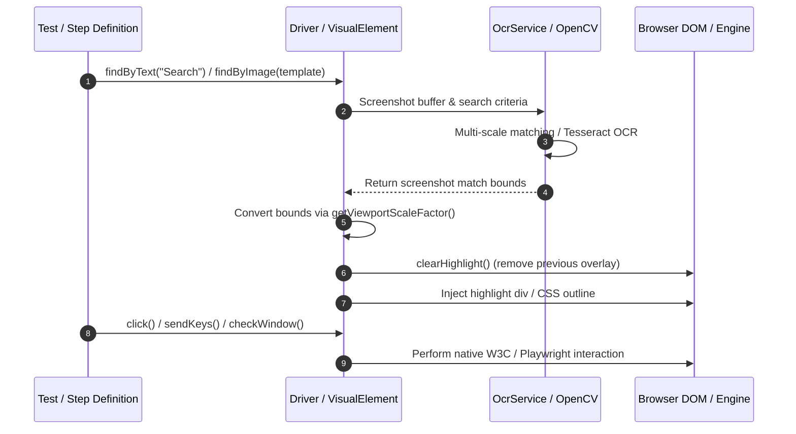

# OCR & Image Recognition Subsystem in teswiz

## Overview

**teswiz** provides an embedded, 100% offline, free, Apache 2.0 open-source Visual OCR (Optical Character Recognition) and Multi-Scale Image Recognition subsystem. This subsystem enables automated test scripts across **Selenium (Web)**, **Playwright**, and **Appium (Android & iOS Mobile)** to locate and interact with UI elements on screen using exact/fuzzy text matching or image template matching without relying on traditional DOM or native XPaths.

---

## Architecture & Zero Core Weight Principles

1. **Zero Core Footprint**: `teswiz` core JAR declares `opencv`, `tess4j`, and `onnxruntime` as `compileOnly` dependencies. Downstream projects using `teswiz` carry **0 MB additional weight** by default.
2. **On-Demand Enablement**: When `IS_OCR_ENABLED=true` is set in configuration properties or environment variables, visual recognition capability is activated, and runtime dependencies are downloaded on demand if needed.
3. **Graceful Subsystem Protection**: When `IS_OCR_ENABLED=false` (default), invoking visual element locator methods throws a descriptive `VisualSubsystemDisabledException` explaining how to enable OCR capability in `config.properties`.
4. **Automatic Element Highlighting & Highlight Removal**: Visual/DOM interactions draw an orange-red translucent bounding box around target elements (`HIGHLIGHT_ELEMENTS=true`, default `true`). Before the next element interaction or visual check runs, previous highlights are automatically removed (`clearHighlight()`).

---

## Subsystem Interaction Flow



---

## High-DPI / Retina Display Scaling & Portability

The visual subsystem handles screen resolutions, High-DPI displays (macOS Retina 2x/3x, Windows 125%/150%/200% scale factor), and headless browser modes (`HEADLESS=true`):

- **Dynamic Scale Factor**: `driver.getViewportScaleFactor(screenshotImageWidth)` calculates `scaleFactor = screenshotImageWidth / window.innerWidth` at runtime.
- **Logical CSS Viewport Bounding**: OCR physical screenshot bounds `(x, y, w, h)` are dynamically divided by `scaleFactor` to produce logical CSS viewport coordinates.
- **Universal Portability**: Highlight overlay `<div>` elements use CSS `position: fixed` and `pointer-events: none`, guaranteeing 100% accurate visual alignment across macOS, Windows, Linux, headed browsers, and headless CI execution.

---

## Technology Stack

- **Tess4J 5 (Tesseract 5 OCR)**: Offline optical character recognition engine for detecting text regions and extracting exact line bounding boxes on screen capture byte streams.
- **OpenCV 4.9 (Multi-Scale Image Pyramid Matching)**: OpenCV template matching using multi-scale Gaussian pyramids (`0.5x` to `2.0x` scaling) to match target image templates regardless of device screen resolution or DPI scaling.
- **PaddleOCR ONNX Runtime**: High-performance ONNX neural OCR engine support for complex images, stylized fonts, and multi-lingual visual text extraction.

---

## Configuration Properties

Configure visual parameters in canonical template `configs/teswiz/teswiz_config.properties.template` or your project execution `.properties` file:

```properties
# Enable/Disable Visual OCR & Image Recognition capability
IS_OCR_ENABLED=false

# Visual match confidence threshold (0.0 to 1.0, default 0.85)
VISUAL_CONFIDENCE_THRESHOLD=0.85

# Enable/Disable interactive element highlighting (default true)
HIGHLIGHT_ELEMENTS=true
```

### Environment Variable Overrides
System properties or environment variables take precedence over configuration files:
- `IS_OCR_ENABLED=true`
- `VISUAL_CONFIDENCE_THRESHOLD=0.90`
- `HIGHLIGHT_ELEMENTS=true`

---

## Usage Guide & API Examples

### 1. Locate Element by Text (`findByText`)

Find an on-screen element using OCR text extraction:

```java
// Find element by exact or contained text string
VisualElement loginButton = driver.findByText("Login");
loginButton.click();
```

### 2. Locate Element by Image Template (`findByImage`)

Find an on-screen element using multi-scale image matching:

```java
// Match single template image
VisualElement profileIcon = driver.findByImage("src/test/resources/images/profile_icon.png");
profileIcon.click();

// Match best candidate across multiple template variations with custom confidence
VisualElement checkoutBtn = driver.findByImage(
    List.of("src/test/resources/images/checkout_v1.png", "src/test/resources/images/checkout_v2.png"),
    0.85
);
checkoutBtn.click();
```

### 3. Fallback Strategies (`findByTextOrImage` & `findByImageOrText`)

Use resilient multi-modal fallback strategies when elements may render text or icons depending on dynamic themes or screen sizes:

```java
// Try OCR text matching first; fallback to image template if text is not found
VisualElement submitBtn = driver.findByTextOrImage("Submit", List.of("src/test/resources/images/submit_icon.png"));
submitBtn.click();

// Try image matching first; fallback to OCR text if icon is missing
VisualElement cartBtn = driver.findByImageOrText(List.of("src/test/resources/images/cart_icon.png"), "Cart");
cartBtn.click();
```

---

## VisualElement & Web Actions with Auto-Highlighting

When `HIGHLIGHT_ELEMENTS=true` (default), standard interaction methods across Selenium, Playwright-Java, Playwright-TS, and Appium automatically clear existing highlights, apply orange-red outlines, and dispatch native actions:

```java
VisualElement element = driver.findByText("Settings");

element.click();                       // Left-click / Mobile Tap at center
element.doubleClick();                 // Double-click / Mobile Double Tap
element.hover();                       // Mouse hover over center
element.sendKeys("Search query");       // Focus & type text
element.tap();                         // Mobile tap
element.doubleTap();                   // Mobile double tap
element.swipe(Direction.UP);           // W3C gesture swipe UP on element
element.dragAndDropTo(targetElement); // Drag element center to target element
```

---

## Exception Handling

If OCR capability is invoked when `IS_OCR_ENABLED=false`, `VisualSubsystemDisabledException` is thrown:

```
com.znsio.teswiz.exceptions.VisualSubsystemDisabledException: 
[teswiz] Visual OCR & Image Recognition Subsystem is Disabled! 
To enable visual text/image locators (findByText, findByImage), set 'IS_OCR_ENABLED=true' in your execution config.properties file or system properties.
```

If an element cannot be matched visually above `VISUAL_CONFIDENCE_THRESHOLD`:

```
com.znsio.teswiz.exceptions.NoSuchVisualElementException: 
[teswiz] Unable to locate visual element by text/image template matching on screen. Target: 'Login', Threshold: 0.85
```

---

## Verification & Build Validation

Verify template synchronization and build integrity:

```bash
./gradlew validateConfigurationTemplates
./gradlew test --tests "com.znsio.teswiz.visual.VisualSubsystemTest"
```
