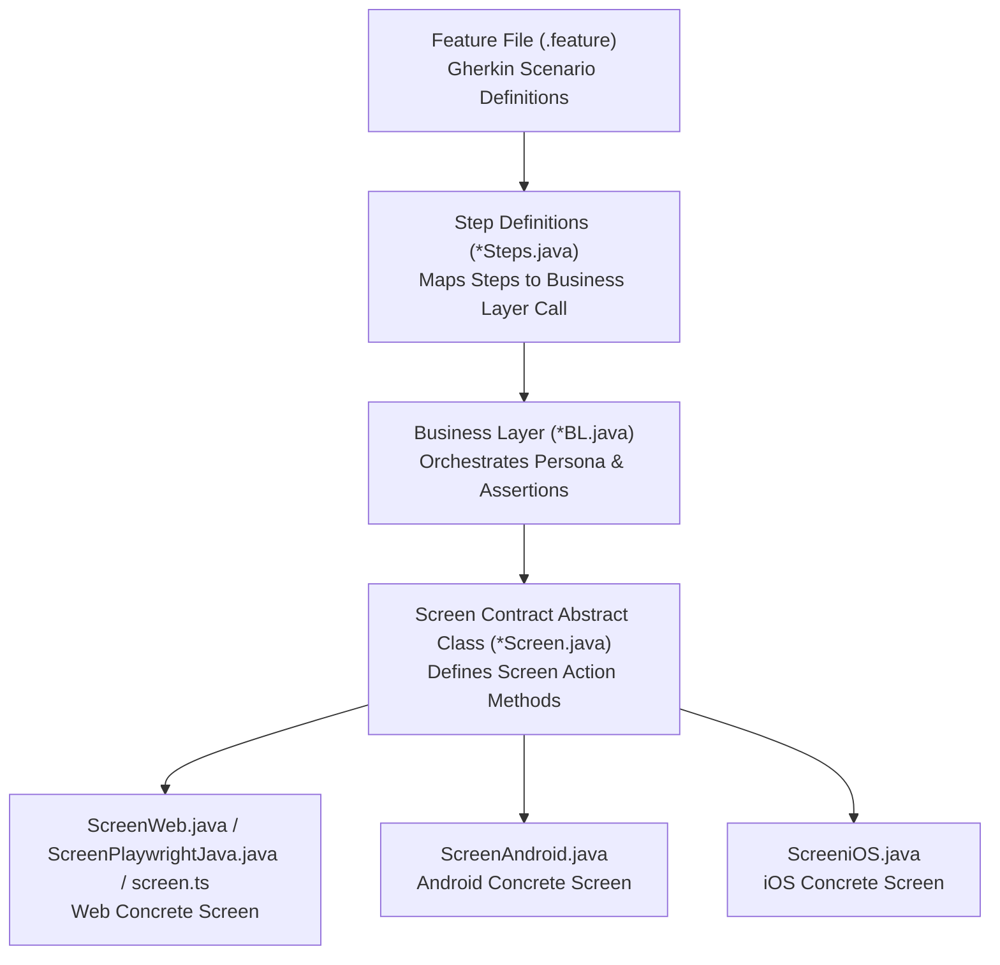

[📚 Documentation Index](../index.md) • [🏠 Main README](../../README.md)

---

# ✍️ Writing Your First Test

**teswiz** follows a strict, layered architecture for test authoring: **Feature File -> Step Definition -> Business Layer (BL) -> Screen Contract**.

---

## 🏗️ Architecture Layers



| Layer | Responsibility | Directory Location |
| :--- | :--- | :--- |
| **Feature Files** | Declarative Gherkin scenarios depicting business functionality without raw UI locator details. | `src/test/resources/com/znsio/teswiz/features/*.feature` |
| **Step Definitions** | Maps Gherkin steps to Business Layer (`BL`) invocations. | `src/test/java/com/znsio/teswiz/steps/*Steps.java` |
| **Business Layer (BL)** | Orchestrates persona creation (`Drivers.createDriverFor`), business flow logic, and assertions. | `src/test/java/com/znsio/teswiz/businessLayer/*/*BL.java` |
| **Screen Contract & Screens** | Defines screen contract (`*Screen.java`) and platform-specific element locators/interactions. | `src/test/java/com/znsio/teswiz/screen/*/*Screen.java` |

---

## 🚀 Step-by-Step Tutorial

### 1. Create Configuration Property File

Create a properties file under `./configs/`:

```properties
PLATFORM=web
WEB_ENGINE=selenium
ENVIRONMENT_CONFIG_FILE=./src/test/resources/environments.json
BASE_URL_FOR_WEB=THEAPP_BASE_URL
TEST_DATA_FILE=./src/test/resources/testData.json
```

### 2. Define Base URL & Test Data

In `src/test/resources/environments.json`:

```json
{
  "prod": {
    "THEAPP_BASE_URL": "https://the-internet.herokuapp.com"
  }
}
```

### 3. Write Gherkin Feature Scenario

In `src/test/resources/com/znsio/teswiz/features/login.feature`:

```gherkin
@web @login
Feature: User Authentication Flow

  Scenario: User should be able to log in successfully
    Given I land on the login page as a registered "User"
    When I log in with valid credentials
    Then I should see the dashboard
```

### 4. Implement Step Definition

In `src/test/java/com/znsio/teswiz/steps/LoginSteps.java`:

```java
public class LoginSteps {
    @Given("I land on the login page as a registered {string}")
    public void iLandOnLoginPage(String userPersona) {
        new LoginBL(userPersona).landOnLoginPage();
    }
}
```

### 5. Implement Business Layer (BL)

In `src/test/java/com/znsio/teswiz/businessLayer/login/LoginBL.java`:

```java
public class LoginBL {
    private final String userPersona;

    public LoginBL(String userPersona) {
        this.userPersona = userPersona;
        Drivers.createDriverFor(userPersona, Platform.web, Runner.getPlatform());
    }

    public LoginBL landOnLoginPage() {
        LoginScreen.get().verifyLoginPageLoaded();
        return this;
    }
}
```

### 6. Define Abstract Screen Contract & Concrete Implementations

In `src/test/java/com/znsio/teswiz/screen/login/LoginScreen.java`:

```java
public abstract class LoginScreen {
    public static LoginScreen get() {
        return (LoginScreen) ScreenImplementationResolver.getScreen(LoginScreen.class);
    }

    public abstract LoginScreen verifyLoginPageLoaded();
}
```

In `src/test/java/com/znsio/teswiz/screen/web/login/LoginScreenWeb.java`:

```java
public class LoginScreenWeb extends LoginScreen {
    private final Driver driver;

    public LoginScreenWeb(Driver driver) {
        this.driver = driver;
    }

    @Override
    public LoginScreen verifyLoginPageLoaded() {
        assertThat(driver.getInnerDriver().getTitle()).contains("The Internet");
        return this;
    }
}
```

---

## 💻 Execute Your Test

```bash
CONFIG=./configs/theapp/theapp_local_web_config.properties PLATFORM=web TAG=@login ./gradlew run
```

> [!TIP]
> Always run `./gradlew verifyScreenContracts` after adding new screen classes to ensure full screen contract parity across engines.
