# 📚 teswiz Documentation Hub

[🏠 Main README](../README.md) • [🚀 Getting Started](#-getting-started) • [⚙️ Core Engines](#%EF%B8%8F-core-engines) • [🧩 Subsystems](#-cross-cutting-subsystems) • [🏗️ Architecture](#%EF%B8%8F-architecture--internals)

---

Welcome to the official **teswiz** documentation hub. Explore the structured guides, engine parity references, subsystem configurations, and architectural deep-dives below.

---

## 🗺️ Documentation Taxonomy

```mermaid
flowchart TD
    INDEX["teswiz Documentation Hub"] --> GS["🚀 Getting Started"]
    INDEX --> ENG["⚙️ Core Engines"]
    INDEX --> SUB["🧩 Subsystems"]
    INDEX --> CFG["🎛️ Configuration"]
    INDEX --> EX["💡 Code Examples"]
    INDEX --> ARCH["🏗️ Architecture & Internals"]

    GS --> GS1["Prerequisites"]
    GS --> GS2["Getting Started Guide"]
    GS --> GS3["Writing Your First Test"]
    GS --> GS4["Configuring Test Execution"]
    GS --> GS5["Sample Tests Overview"]

    ENG --> ENG1["Web Engines (Selenium / PW-Java / PW-TS)"]
    ENG --> ENG2["Mobile Setup (Appium Android & iOS)"]
    ENG --> ENG3["API Engines (RestAssured / PW-Java / PW-TS)"]

    SUB --> SUB1["Applitools Visual AI"]
    SUB --> SUB2["Tesseract OCR & OpenCV"]
    SUB --> SUB3["ReportPortal Integration"]
    SUB --> SUB4["AspectJ Logging"]
    SUB --> SUB5["BrowserStack Local"]

    CFG --> CFG1["Configuration Parameters"]
    CFG --> CFG2["Docker Setup"]
    CFG --> CFG3["Hard Gate Execution"]

    EX --> EX1["Web Examples (Selenium, PW-Java, PW-TS)"]
    EX --> EX2["Mobile Examples (Android, iOS)"]
    EX --> EX3["API & Document Examples (API, PDF)"]

    ARCH --> ARCH1["Architecture Notes"]
    ARCH --> ARCH2["Feature Coverage"]
    ARCH --> ARCH3["Migration Guides"]
    ARCH --> ARCH4["Debugging & FAQs"]
```

---

## 🚀 Getting Started

| Guide | Description | Target Audience |
| :--- | :--- | :--- |
| 🛠️ **[Prerequisites](getting-started/prerequisites.md)** | JDK 17, Node.js, and driver environment setup | New Developers |
| 🎬 **[Getting Started Guide](getting-started/getting-started-guide.md)** | High-level framework walk-through and setup | All Users |
| ✍️ **[Writing Your First Test](getting-started/writing-first-test.md)** | Authoring Cucumber BDD features, step defs, BL, and screens | Test Authors |
| 🎛️ **[Configuring Test Execution](getting-started/configuring-test-execution.md)** | Running suites via Cucumber or TestNG modes (`FRAMEWORK`) | Test Leads & CI Engineers |
| 🧪 **[Sample Tests Overview](getting-started/sample-tests.md)** | Guide to bundled sample test suites | All Users |

---

## ⚙️ Core Engines

| Engine Reference | Platform | Key Capabilities |
| :--- | :--- | :--- |
| 🌐 **[Web Engine Capabilities & Parity](engines/web-engine-capabilities.md)** | Web | Parity matrix across `selenium`, `playwright-java`, and `playwright-ts` |
| 📱 **[Mobile Execution Setup](engines/mobile-appium-setup.md)** | Mobile | Appium 2 driver configuration for Android & iOS execution |
| 🔌 **[API Test Execution](engines/running-api-tests.md)** | API | Unified API automation via `rest-assured`, `playwright-java`, and `playwright-ts` |

---

## 🧩 Cross-Cutting Subsystems

| Subsystem | Description | Quick Link |
| :--- | :--- | :--- |
| 👁️ **Applitools Visual AI** | Applitools Eyes and Ultrafast Grid (UFG) configuration for Web and Mobile | [Setup Guide](subsystems/visual-ai-applitools.md) |
| 🔍 **Tesseract OCR & OpenCV** | Embedded 100% offline text recognition & multi-scale template matching | [OCR Guide](subsystems/ocr-and-image-recognition.md) |
| 📊 **ReportPortal Integration** | Real-time test result dashboard publishing and launch metadata | [ReportPortal Setup](subsystems/reportportal-integration.md) |
| 📝 **AspectJ Logging** | Automated framework and test method execution tracing | [Logging Guide](subsystems/aspectj-logging.md) |
| 🔒 **BrowserStack Local** | Configuring secure tunnel connections for cloud grid testing | [Local Testing Setup](subsystems/browserstack-local.md) |

---

## 🎛️ Configuration & Infrastructure

- 📋 **[Configuration Parameters Reference](configuration/configuration-parameters.md)**: Complete parameter contract for `config.properties`.
- 🐳 **[Docker Execution Setup](configuration/docker-setup.md)**: Containerized test execution guide.
- 🚧 **[Hard Gate Execution Mode](configuration/hard-gate.md)**: Hard quality gate enforcement for known-failing test suites (`IS_FAILING_TEST_SUITE`).

---

## 💡 Code Examples

- **Web Automation**:
  - 🌐 [Web Selenium Example](examples/web-selenium-example.md)
  - 🎭 [Web Playwright-Java Example](examples/web-playwright-java-example.md)
  - ⚡ [Web Playwright-TS Example](examples/web-playwright-ts-example.md)
- **Mobile Automation**:
  - 🤖 [Android Example](examples/android-example.md)
  - 🍎 [iOS Example](examples/ios-example.md)
- **API & Document Validation**:
  - 🔌 [API Execution Example](examples/api-example.md)
  - 📄 [PDF Document Validation Example](examples/pdf-example.md)

---

## 🏗️ Architecture & Internals

- 📐 **[Runtime Architecture Notes](architecture-and-internals/architecture-notes.md)**: Deep-dive into engine routing, persona ownership, and screen resolution.
- 📊 **[Feature Coverage Matrix](architecture-and-internals/feature-coverage.md)**: Framework capability and platform breakdown.
- 🔄 **[Playwright Migration Guide](architecture-and-internals/playwright-migration-guide.md)**: Porting Selenium suites to Playwright engines.
- ⚡ **[Cucumber to TestNG Migration Guide](architecture-and-internals/cucumber-to-testng-migration-guide.md)**: Porting Gherkin feature suites to TestNG `@Test` classes.
- 🚨 **[Breaking Changes Log](architecture-and-internals/breaking-changes.md)**: Historical upgrade notes and breaking change log.
- 🐞 **[Debugging Tests](architecture-and-internals/debugging-tests.md)**: Troubleshooting log files, command outputs, and visual diff artifacts.
- ❓ **[Frequently Asked Questions (FAQs)](architecture-and-internals/faqs.md)**: Common framework questions and resolutions.
