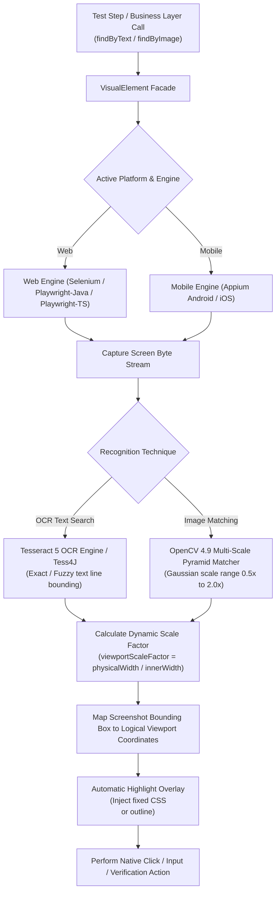
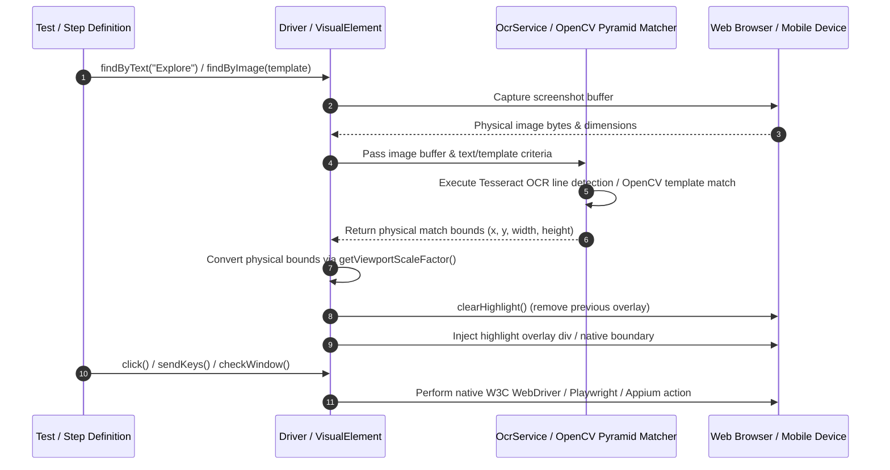

# OCR & Image Recognition Subsystem in teswiz
[📚 Documentation Index](../index.md) • [🏠 Main README](../../README.md)

---


## Table of Contents

- [Overview](#overview)
- [Architecture & Zero Core Weight Principles](#architecture--zero-core-weight-principles)
- [Subsystem Architecture & Interaction Flow](#subsystem-architecture--interaction-flow)
- [High-DPI / Retina Display Scaling & Portability](#high-dpi--retina-display-scaling--portability)
- [Technology Stack](#technology-stack)
- [Configuration Properties](#configuration-properties)
  - [Environment Variable Overrides](#environment-variable-overrides)
- [Usage Guide & API Examples](#usage-guide--api-examples)
  - [1. Locate Element by Text (`findByText`)](#1-locate-element-by-text-findbytext)
  - [2. Locate Element by Image Template (`findByImage`)](#2-locate-element-by-image-template-findbyimage)
  - [3. Fallback Strategies (`findByTextOrImage` & `findByImageOrText`)](#3-fallback-strategies-findbytextorimage--findbyimageortext)
  - [4. Extract All Visual Elements (`findAllByText` & `findAllByImage`)](#4-extract-all-visual-elements-findallbytext--findallbyimage)
  - [BDD Step Definitions for Multi-Match & Positions](#bdd-step-definitions-for-multi-match--positions)
  - [5. Wait Until an Element Becomes Visible (`waitUntilVisualElementIsVisible*`)](#5-wait-until-an-element-becomes-visible-waituntilvisualelementisvisible)
  - [6. Proximity & Spatial Relative Locators (`findRelativeByText` & `findRelativeByImage`)](#6-proximity--spatial-relative-locators-findrelativebytext--findrelativebyimage)
  - [7. Dynamic Proxy Locators (`VisualBy`)](#7-dynamic-proxy-locators-visualby)
- [VisualElement & Web Actions with Auto-Highlighting](#visualelement--web-actions-with-auto-highlighting)
- [Exception Handling](#exception-handling)
- [Verification & Build Validation](#verification--build-validation)

---


## 🛠️ Overview

**teswiz** provides an embedded, 100% offline, free, Apache 2.0 open-source Visual OCR (Optical Character Recognition) and Multi-Scale Image Recognition subsystem. This subsystem enables automated test scripts across **Selenium (Web)**, **Playwright**, and **Appium (Android & iOS Mobile)** to locate and interact with UI elements on screen using exact/fuzzy text matching or image template matching without relying on traditional DOM or native XPaths.

---

## 🏗️ Architecture & Zero Core Weight Principles

1. **Zero Core Footprint**: `teswiz` core JAR declares `opencv`, `tess4j`, and `onnxruntime` as `compileOnly` dependencies. Downstream projects using `teswiz` carry **0 MB additional weight** by default.
2. **On-Demand Enablement**: When `IS_OCR_ENABLED=true` is set in configuration properties or environment variables, visual recognition capability is activated, and runtime dependencies are downloaded on demand if needed.
3. **Graceful Subsystem Protection**: When `IS_OCR_ENABLED=false` (default), invoking visual element locator methods throws a descriptive `VisualSubsystemDisabledException` explaining how to enable OCR capability in `config.properties`.
4. **Automatic Element Highlighting & Highlight Removal**: Visual/DOM interactions draw an orange-red translucent bounding box around target elements (`HIGHLIGHT_ELEMENTS=true`, default `true`). Before the next element interaction or visual check runs, previous highlights are automatically removed (`clearHighlight()`).

---

## 🏗️ Subsystem Architecture & Interaction Flow





---

## 🖥️ High-DPI / Retina Display Scaling & Portability

The visual subsystem handles screen resolutions, High-DPI displays (macOS Retina 2x/3x, Windows 125%/150%/200% scale factor), and headless browser modes (`HEADLESS=true`):

- **Dynamic Scale Factor**: `driver.getViewportScaleFactor(screenshotImageWidth)` calculates `scaleFactor = screenshotImageWidth / window.innerWidth` at runtime.
- **Logical CSS Viewport Bounding**: OCR physical screenshot bounds `(x, y, w, h)` are dynamically divided by `scaleFactor` to produce logical CSS viewport coordinates.
- **Universal Portability**: Highlight overlay `<div>` elements use CSS `position: fixed` and `pointer-events: none`, guaranteeing 100% accurate visual alignment across macOS, Windows, Linux, headed browsers, and headless CI execution.

---

## 🧰 Technology Stack

- **Tess4J 5 (Tesseract 5 OCR)**: Offline optical character recognition engine for detecting text regions and extracting exact line bounding boxes on screen capture byte streams.
- **OpenCV 4.9 (Multi-Scale Image Pyramid Matching)**: OpenCV template matching using multi-scale Gaussian pyramids (`0.5x` to `2.0x` scaling) to match target image templates regardless of device screen resolution or DPI scaling.
- **PaddleOCR ONNX Runtime**: High-performance ONNX neural OCR engine support for complex images, stylized fonts, and multi-lingual visual text extraction.

---

## 🎛️ Configuration Properties

Configure visual parameters in canonical template `configs/teswiz/teswiz_config.properties.template` or your project execution `.properties` file:

```properties
# Enable/Disable Visual OCR & Image Recognition capability (default false)
IS_OCR_ENABLED=false

# Visual match confidence threshold (0.0 to 1.0, default 0.85)
VISUAL_CONFIDENCE_THRESHOLD=0.85

# Number of attempts and per-attempt delay (seconds) used when polling for a visual element -
# e.g. count/at-least verifications and waitUntilVisualElementIsVisible* (defaults: 3 attempts, 1 second).
VISUAL_ELEMENT_RETRY_ATTEMPTS=3
VISUAL_ELEMENT_RETRY_DELAY_SECONDS=1

# Configurable post-action settle delay in seconds after visual clicks/inputs (default 1)
VISUAL_ACTION_WAIT_SECONDS=1

# Enable/Disable interactive element highlighting (default true)
HIGHLIGHT_ELEMENTS=true
```

> The default maximum wait for `waitUntilVisualElementIsVisible*` (when no explicit timeout is passed) is derived
> from `VISUAL_ELEMENT_RETRY_ATTEMPTS x VISUAL_ELEMENT_RETRY_DELAY_SECONDS`, and the inter-poll sleep is
> `VISUAL_ELEMENT_RETRY_DELAY_SECONDS`.

### Environment Variable Overrides
System properties or environment variables take precedence over configuration files:
- `IS_OCR_ENABLED=true`
- `VISUAL_CONFIDENCE_THRESHOLD=0.90`
- `VISUAL_ELEMENT_RETRY_ATTEMPTS=5`
- `VISUAL_ELEMENT_RETRY_DELAY_SECONDS=2`
- `VISUAL_ACTION_WAIT_SECONDS=2`
- `HIGHLIGHT_ELEMENTS=true`

---

## 💡 Usage Guide & API Examples

### 1. Locate Element by Text (`findByText`)

Find an on-screen element using OCR text extraction:

```java
// Find element by exact or contained text string
VisualElement loginButton = driver.findByText("Login");
loginButton.click();
```

### 2. Locate Element by Image Template (`findByImage`)

Find an on-screen element using multi-scale image matching:

```java
// Match single template image
VisualElement profileIcon = driver.findByImage("src/test/resources/images/profile_icon.png");
profileIcon.click();

// Match best candidate across multiple template variations with custom confidence
VisualElement checkoutBtn = driver.findByImage(
    List.of("src/test/resources/images/checkout_v1.png", "src/test/resources/images/checkout_v2.png"),
    0.85
);
checkoutBtn.click();
```

### 3. Fallback Strategies (`findByTextOrImage` & `findByImageOrText`)

Use resilient multi-modal fallback strategies when elements may render text or icons depending on dynamic themes or screen sizes:

```java
// Try OCR text matching first; fallback to image template if text is not found
VisualElement submitBtn = driver.findByTextOrImage("Submit", List.of("src/test/resources/images/submit_icon.png"));
submitBtn.click();

// Try image matching first; fallback to OCR text if icon is missing
VisualElement cartBtn = driver.findByImageOrText(List.of("src/test/resources/images/cart_icon.png"), "Cart");
cartBtn.click();
```

### 4. Extract All Visual Elements (`findAllByText` & `findAllByImage`)

Retrieve all matching elements on screen as a `List<VisualElement>` with Non-Maximum Suppression (NMS) duplicate filtering:

```java
// Retrieve all elements matching OCR text "Details"
List<VisualElement> detailButtons = driver.findAllByText("Details");
for (VisualElement item : detailButtons) {
    item.highlight();
}

// Click the 2nd matching visual element
driver.findAllByText("Details").get(1).click();
```

### BDD Step Definitions for Multi-Match & Positions

```gherkin
# Find and highlight all instances on screen (with visual checkpoint)
And I visually find all instances of "a station solid green dot on the map" using image template "src/test/resources/images/solid_green_dot.png"
And I visually find all instances of "Station" using OCR text "Station"
And I visually inspect all instances of "Metro logo" using image template "src/test/resources/images/metro.png"

# Multi-instance fallback matching (OCR text primary; fallback to image template)
And I visually find all instances of "Submit button" using fallback OCR text "Submit" or image template "src/test/resources/images/submit.png"
And I visually find all instances of "Cart icon" using fallback image template "src/test/resources/images/cart.png" or OCR text "Cart"


# Click by ordinal position / alias ("first", "last", "1st", "2nd", "3rd", "4th", etc.)
When I visually click the "first" element matching OCR text "Details"
When I visually click the "last" element matching OCR text "Details"
When I visually click the "2nd" element matching OCR text "Details"

# Click by zero-based integer index
When I visually click element at index 0 matching OCR text "Details"

# Verify exact match count
Then I verify 3 visual elements are present using OCR text "Details"
Then I verify 5 visual elements are present using image template "src/test/resources/images/dot.png"

# Verify minimum match count
Then I verify at least 2 visual elements are present using OCR text "Details"
Then I verify at least 1 visual elements are present using image template "src/test/resources/images/dot.png"
```


### 5. Wait Until an Element Becomes Visible (`waitUntilVisualElementIsVisible*`)

For dynamic screens where an element appears after a delay (animations, async loads), poll until the element is
located on screen or a maximum wait budget elapses. A visual element is reported as *visible* when the OCR/image
matcher locates it on the current screen capture - there is no separate visibility flag. These methods work across
every engine (Selenium, Playwright-Java, Playwright-TS, Appium) because they poll the same engine-agnostic
locators used elsewhere.

Each locator variant has two overloads: one that defaults the maximum wait from configuration, and one that takes
an explicit maximum wait in seconds. If the element does not appear within the budget, the test fails with a
descriptive assertion.

```java
VisualOcrBL visual = new VisualOcrBL();

// By OCR text - default wait budget (VISUAL_ELEMENT_RETRY_ATTEMPTS x VISUAL_ELEMENT_RETRY_DELAY_SECONDS)
VisualElement banner = visual.waitUntilVisualElementIsVisibleByText("Order Confirmed");

// By OCR text - explicit maximum wait of 15 seconds
visual.waitUntilVisualElementIsVisibleByText("Order Confirmed", 15);

// By image template (default / explicit timeout)
visual.waitUntilVisualElementIsVisibleByImage("src/test/resources/images/spinner_done.png");
visual.waitUntilVisualElementIsVisibleByImage("src/test/resources/images/spinner_done.png", 20);

// Fallback: OCR text first, then image template (or the reverse)
visual.waitUntilVisualElementIsVisibleByTextOrImage("Continue", "src/test/resources/images/continue.png", 10);
visual.waitUntilVisualElementIsVisibleByImageOrText("src/test/resources/images/continue.png", "Continue", 10);
```

#### BDD Step Definitions for Wait Until Visible

```gherkin
# Default wait budget (from configuration)
When I wait until visual element is visible using OCR text "Order Confirmed"
When I wait until visual element is visible using image template "src/test/resources/images/spinner_done.png"
When I wait until visual element is visible using fallback OCR text "Continue" or image template "src/test/resources/images/continue.png"
When I wait until visual element is visible using fallback image template "src/test/resources/images/continue.png" or OCR text "Continue"

# Explicit maximum wait in seconds
When I wait until visual element is visible using OCR text "Order Confirmed" within 15 seconds
When I wait until visual element is visible using image template "src/test/resources/images/spinner_done.png" within 20 seconds
When I wait until visual element is visible using fallback OCR text "Continue" or image template "src/test/resources/images/continue.png" within 10 seconds
When I wait until visual element is visible using fallback image template "src/test/resources/images/continue.png" or OCR text "Continue" within 10 seconds
```


### 6. Proximity & Spatial Relative Locators (`findRelativeByText` & `findRelativeByImage`)

Locate targets relative to an anchor text/image on screen (`ABOVE`, `BELOW`, `LEFT_OF`, `RIGHT_OF`, `NEAR`):

```java
// Find text "Submit" located to the RIGHT_OF anchor text "Cancel"
VisualElement submitBtn = driver.findRelativeByText("Submit", SpatialDirection.RIGHT_OF, "Cancel");
submitBtn.click();

// Find element "Total" BELOW anchor text "Subtotal"
VisualElement totalAmount = driver.findRelativeByText("Total", SpatialDirection.BELOW, "Subtotal");
```

### 7. Dynamic Proxy Locators (`VisualBy`)

Use `VisualBy` locators seamlessly with standard `Driver.findElement` / `Driver.findElements` calls:

```java
// Dynamic OCR text locator proxy
WebElement loginBtn = driver.findElement(VisualBy.ocr("Login"));
loginBtn.click();

// Dynamic template image locator proxy
WebElement logo = driver.findElement(VisualBy.image("src/test/resources/images/logo.png", 0.90));
```

---

## VisualElement & Web Actions with Auto-Highlighting


When `HIGHLIGHT_ELEMENTS=true` (default), standard interaction methods across Selenium, Playwright-Java, Playwright-TS, and Appium automatically clear existing highlights, apply orange-red outlines, and dispatch native actions:

```java
VisualElement element = driver.findByText("Settings");

element.click();                       // Left-click / Mobile Tap at center
element.doubleClick();                 // Double-click / Mobile Double Tap
element.hover();                       // Mouse hover over center
element.sendKeys("Search query");       // Focus & type text
element.tap();                         // Mobile tap
element.doubleTap();                   // Mobile double tap
element.longPress();                   // Long-press (default 2s) / longPress(Duration)
element.swipe(Direction.UP);           // W3C gesture swipe UP on element
element.dragAndDropTo(targetElement); // Drag element center to target element
```

Each visual element gesture is dispatched through the real input pipeline for the active engine. The dispatch
order is Appium touch → browser native coordinate input (used by Playwright, so gestures also reach `<canvas>`
content) → Selenium `Actions` → synthesised DOM events as a last resort. If a driver supports none of these for a
given gesture, the action is logged as not performed rather than failing silently.

### Before / After Screenshots on Visual Actions

Every visual OCR action performed through the screen layer (click, double-click, hover, long-press, swipe, enter
text, position/index/relative clicks, and the `tryClick*` variants) captures a **before** screenshot, performs the
action, waits `VISUAL_ACTION_WAIT_SECONDS`, then captures an **after** screenshot. This makes the effect of each
visual interaction traceable in the run artifacts. Inspection methods (`inspect*`) capture a single screenshot and
perform no action.

---

## Exception Handling

If OCR capability is invoked when `IS_OCR_ENABLED=false`, `VisualSubsystemDisabledException` is thrown:

```
com.znsio.teswiz.exceptions.VisualSubsystemDisabledException: 
[teswiz] Visual OCR & Image Recognition Subsystem is Disabled! 
To enable visual text/image locators (findByText, findByImage), set 'IS_OCR_ENABLED=true' in your execution config.properties file or system properties.
```

If an element cannot be matched visually above `VISUAL_CONFIDENCE_THRESHOLD`:

```
com.znsio.teswiz.exceptions.NoSuchVisualElementException: 
[teswiz] Unable to locate visual element by text/image template matching on screen. Target: 'Login', Threshold: 0.85
```

---

## Verification & Build Validation

Verify template synchronization and build integrity:

```bash
./gradlew validateConfigurationTemplates
./gradlew test --tests "com.znsio.teswiz.visual.VisualSubsystemTest"
```
