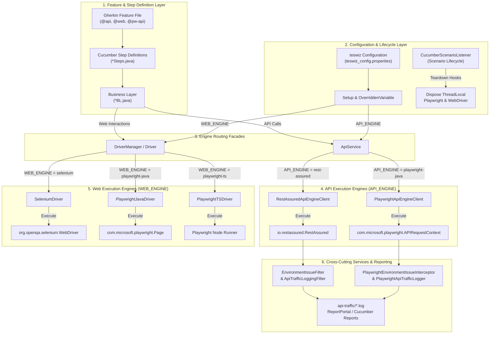

# Playwright API Testing Engine (`API_ENGINE`) Implementation & Migration Plan

This document outlines the implementation plan for introducing Playwright API testing capability to **teswiz** as a configurable engine (`API_ENGINE`) alongside the existing `RestAssured` engine, as well as migration guidelines and Cucumber `@pw-api` sample scenarios.

---

## 1. Executive Summary & Key Architecture Decisions

1. **Engine Selection & Default:** A new property `API_ENGINE` will be introduced in `Setup.java` and canonical configuration templates. It defaults to `rest-assured` to ensure **100% backwards compatibility** for all existing teswiz test suites.
2. **Unified API Engine Facade (`ApiService`):** Rather than forcing users to manage Playwright `APIRequestContext` or RestAssured `RequestSpecification` directly, teswiz exposes a unified `ApiService` facade and normalized response object (`TeswizApiResponse`).
3. **Legacy Compatibility:** `RestAssuredService` remains fully supported for legacy code.
4. **Thread Safety & Lifecycle:** Playwright `APIRequestContext` instances are thread-isolated using `ThreadLocal` storage and automatically cleaned up per scenario using `CucumberScenarioListener`.
5. **Cucumber Multi-Engine Support:** Dedicated Cucumber feature scenarios (`@api`, `@pw-api`, `@restassured-api`) demonstrate executing API tests via both Playwright Java and RestAssured engines, validating response codes, headers, HTML/JSON payloads, and all HTTP methods (GET, POST, PUT, PATCH, DELETE, HEAD, OPTIONS).

---

## 2. Proposed Code Changes & Architecture

### Phase 1: Configuration & Canonical Contract (`API_ENGINE`)

- **[MODIFY] [Setup.java](file:///Users/anand.bagmar/projects/znsio/teswiz/src/main/java/com/znsio/teswiz/runner/Setup.java)**
  - Define `public static final String API_ENGINE = "API_ENGINE";`
  - Add logic to load and validate `API_ENGINE` configuration.

- **[NEW] `com.znsio.teswiz.api.ApiEngine`** ([ApiEngine.java](file:///Users/anand.bagmar/projects/znsio/teswiz/src/main/java/com/znsio/teswiz/api/ApiEngine.java))
  - Enum values: `REST_ASSURED("rest-assured")`, `PLAYWRIGHT_JAVA("playwright-java")`.
  - Parses and validates raw configuration strings.

- **[MODIFY] [teswiz_config.properties.template](file:///Users/anand.bagmar/projects/znsio/teswiz/configs/teswiz/teswiz_config.properties.template)**
  - Add `# API_ENGINE=rest-assured` to the template.

- **[MODIFY] `configs/**/*.properties`**
  - Add `#API_ENGINE=rest-assured` across all existing property files to satisfy `./gradlew validateConfigurationTemplates`.

---

### Phase 2: Core Abstraction & Playwright Engine Implementation

- **[NEW] `com.znsio.teswiz.api.TeswizApiResponse`** ([TeswizApiResponse.java](file:///Users/anand.bagmar/projects/znsio/teswiz/src/main/java/com/znsio/teswiz/api/TeswizApiResponse.java))
  - Engine-agnostic response wrapper hiding internal response implementation:
    - `int getStatusCode()`
    - `String getResponseBody()`
    - `byte[] getResponseBodyAsBytes()`
    - `Map<String, String> getHeaders()`
    - Convenience methods for JSON processing (`asJsonObject()`, `asJsonArray()`).

- **[NEW] `com.znsio.teswiz.api.ApiEngineClient`** ([ApiEngineClient.java](file:///Users/anand.bagmar/projects/znsio/teswiz/src/main/java/com/znsio/teswiz/api/ApiEngineClient.java))
  - Common HTTP client interface for all standard HTTP methods: `get`, `post`, `put`, `patch`, `delete`, `head`, `options`.

- **[NEW] `com.znsio.teswiz.api.RestAssuredApiEngineClient`** ([RestAssuredApiEngineClient.java](file:///Users/anand.bagmar/projects/znsio/teswiz/src/main/java/com/znsio/teswiz/api/RestAssuredApiEngineClient.java))
  - Implements `ApiEngineClient` delegating to RestAssured.

- **[NEW] `com.znsio.teswiz.api.PlaywrightApiEngineClient`** ([PlaywrightApiEngineClient.java](file:///Users/anand.bagmar/projects/znsio/teswiz/src/main/java/com/znsio/teswiz/api/PlaywrightApiEngineClient.java))
  - Implements `ApiEngineClient` delegating to `com.microsoft.playwright.APIRequestContext`.

- **[NEW] `com.znsio.teswiz.api.PlaywrightApiManager`** ([PlaywrightApiManager.java](file:///Users/anand.bagmar/projects/znsio/teswiz/src/main/java/com/znsio/teswiz/api/PlaywrightApiManager.java))
  - Manages `ThreadLocal<Playwright>` and `ThreadLocal<APIRequestContext>`.
  - Handles base URL, SSL validation settings, proxy parameters (`PROXY_URL`), and extra headers.
  - Implements `closeContextForCurrentThread()` for teardown.

- **[NEW] `com.znsio.teswiz.services.ApiService`** ([ApiService.java](file:///Users/anand.bagmar/projects/znsio/teswiz/src/main/java/com/znsio/teswiz/services/ApiService.java))
  - Unified entry point for API calls in Business Layer code, dynamically dispatching to the configured `ApiEngineClient`.

- **[MODIFY] [RestAssuredService.java](file:///Users/anand.bagmar/projects/znsio/teswiz/src/main/java/com/znsio/teswiz/services/RestAssuredService.java)**
  - Preserved for backwards compatibility.

---

### Phase 3: Cross-Cutting Concerns Parity & Cucumber Playwright API Tests

- **[MODIFY] [CucumberScenarioListener.java](file:///Users/anand.bagmar/projects/znsio/teswiz/src/main/java/com/znsio/teswiz/listener/CucumberScenarioListener.java)**
  - Invokes `PlaywrightApiManager.closeContextForCurrentThread()` at scenario finish.

- **[NEW] `com.znsio.teswiz.filters.PlaywrightEnvironmentIssueInterceptor`** ([PlaywrightEnvironmentIssueInterceptor.java](file:///Users/anand.bagmar/projects/znsio/teswiz/src/main/java/com/znsio/teswiz/filters/PlaywrightEnvironmentIssueInterceptor.java))
  - Intercepts Playwright API responses for status codes `502`, `503`, `504` and throws `EnvironmentSetupException` when `DISABLE_ENVIRONMENT_ISSUE_FILTER=false`.

- **[NEW] `com.znsio.teswiz.filters.apitraffic.PlaywrightApiTrafficLogger`** ([PlaywrightApiTrafficLogger.java](file:///Users/anand.bagmar/projects/znsio/teswiz/src/main/java/com/znsio/teswiz/filters/apitraffic/PlaywrightApiTrafficLogger.java))
  - Formats Playwright requests/responses and logs them via `ApiTrafficRecorder` and `SensitiveDataMasker` to `target/.../api-traffic/*.log` when `API_TRAFFIC_LOGGING=true`.

- **[NEW] Cucumber Feature & Sample Test Suite for Playwright & RestAssured API Engine (`@api`, `@pw-api`, `@restassured-api`)**
  - Add feature file: `src/test/resources/com/znsio/teswiz/features/api_engine_parity.feature`.
  - Add step definitions and business layer using `ApiService` to demonstrate end-to-end execution across engines.

---

## 3. Migration Guides

### Migration Guide 1: RestAssured -> Playwright Java (Primary Migration)

Follow these steps to migrate an existing teswiz API test suite from RestAssured to Playwright Java:

#### Step 1: Update Configuration
In your execution properties file (e.g. `configs/api_local_config.properties`):
```properties
API_ENGINE=playwright-java
```

#### Step 2: Refactor Business Layer (BL) Imports & Response Handling
Replace RestAssured imports and response handling with `ApiService` and `TeswizApiResponse`:

**Before (RestAssured direct usage):**
```java
import com.znsio.teswiz.services.RestAssuredService;
import io.restassured.response.Response;

public class WeatherAPIBL {
    public void checkWeather() {
        Response response = RestAssuredService.getHttpResponseWithQueryMap(baseUrl, queryParams);
        assertThat(response.getStatusCode()).isEqualTo(200);
        String body = response.getBody().asString();
    }
}
```

**After (Engine-agnostic ApiService usage):**
```java
import com.znsio.teswiz.services.ApiService;
import com.znsio.teswiz.api.TeswizApiResponse;

public class WeatherAPIBL {
    public void checkWeather() {
        TeswizApiResponse response = ApiService.get(baseUrl, queryParams);
        assertThat(response.getStatusCode()).isEqualTo(200);
        String body = response.getResponseBody();
    }
}
```

#### Step 3: Validate Execution
- Feature files and Cucumber step definitions remain **100% unchanged**.
- Run tests (`./gradlew run`) and verify traffic log output in `target/.../api-traffic/*.log`.

---

### Migration Guide 2: Playwright Java -> RestAssured (Lower Priority)

To switch a suite back to RestAssured:

1. Change property configuration to `API_ENGINE=rest-assured`.
2. If Business Layer code was written using `ApiService` and `TeswizApiResponse`, **no code changes are needed**; calls are automatically routed to RestAssured under the hood.
3. If custom code used Playwright's `APIRequestContext` directly, replace those calls with `ApiService`.

---

## 4. Verification & Validation Plan

1. **Configuration Validation:**
   ```bash
   ./gradlew validateConfigurationTemplates
   ```
2. **Automated Tests:**
   ```bash
   ./gradlew test --tests "com.znsio.teswiz.runner.ApiEngineSelectionTest"
   ./gradlew test --tests "com.znsio.teswiz.services.ApiServiceTest"
   ./gradlew check
   ```
3. **End-to-End Verification:**
   - Execute sample tests (`WeatherAPIBL`, `JsonPlaceHolderBL`) with `API_ENGINE=rest-assured`.
   - Execute Cucumber `@pw-api` and `@restassured-api` sample tests and confirm parity in response verification, environment issue detection, and traffic logging.

---

## 5. Visual Representation of Execution Flows (`API_ENGINE` & `WEB_ENGINE`)

The diagram below illustrates the end-to-end execution flow starting from Cucumber Feature files down through `API_ENGINE` and `WEB_ENGINE` dispatching to underlying execution clients:


